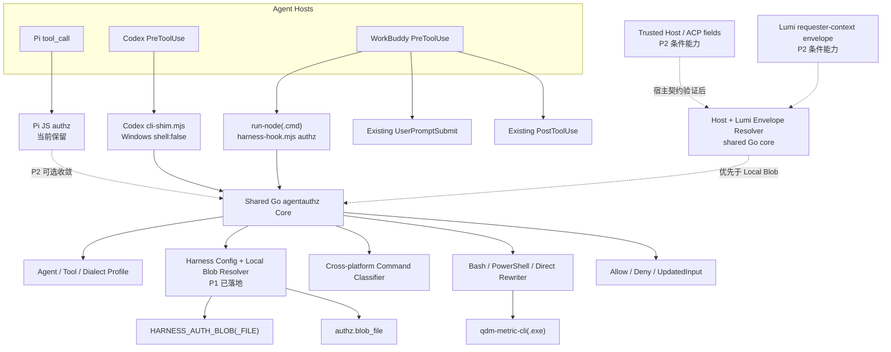
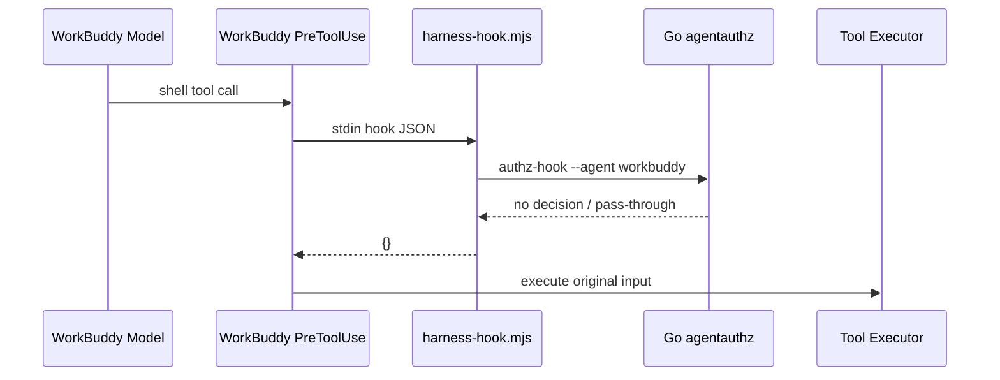
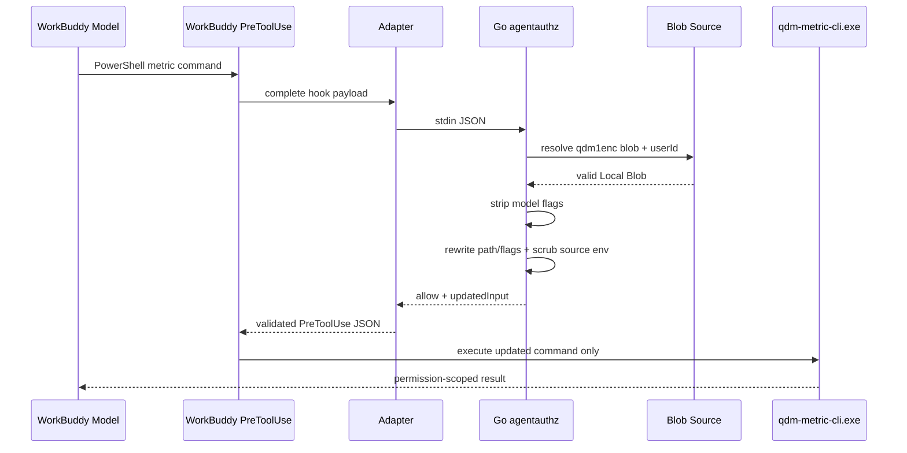
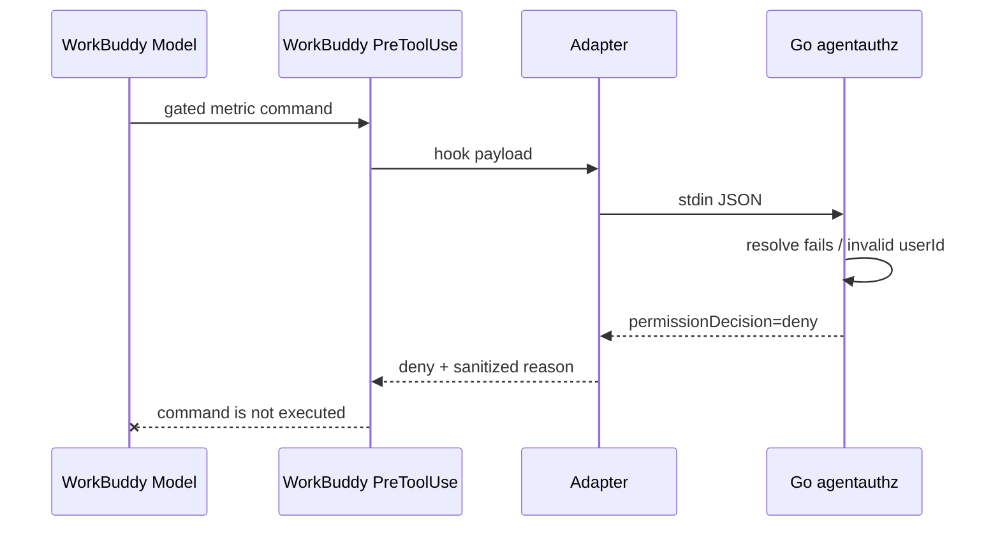

# Windows WorkBuddy 鉴权功能详细实施方案

> 实施跟踪：仓库代码已按本文方案落地，并已根据 2026-08-11 的真实 WorkBuddy 5.3.8 验证结果改为可信 broker 架构；已完成项与复测门槛见 [Windows WorkBuddy 鉴权实施状态](workbuddy-authz-implementation-status.md)。

## 1. 文档目的

本文将以下三份审计/设计文档落实为可开发、可测试、可评审的实施计划：

- `docs/authz-current-implementation.md`
- `docs/pi-codex-workbuddy-hook-report.md`
- `docs/workbuddy-authz-plan.md`

目标是在不改变 `qdm-metric-cli` 权限协议的前提下，为 Windows WorkBuddy 增加执行前 data-auth，并同步补齐 Codex Windows PreToolUse 基线，使 Codex 和 WorkBuddy 共用跨平台 Go `agentauthz` 核心。

本文同时作为修改方案与实施跟踪文档；若历史设计描述与实施状态文档冲突，以实施状态文档和当前代码为准。

## 2. 最终技术决策

### 2.1 主方案

采用以下主链路：

```text
WorkBuddy PreToolUse
  → run-node.cmd
  → harness-hook.mjs authz
  → data-harness-cli authz-hook --agent workbuddy
  → shared Go agentauthz
  → allow + updatedInput(authz-exec broker command, no blob) / deny
  → data-harness-cli authz-exec --agent workbuddy -- <allowed qdm args>
  → broker resolves blob internally and starts qdm-metric-cli
```

设计依据：

- WorkBuddy 与 Codex 都是 stdin/stdout command hook，传输模型相近。
- Codex 已经定义 Go allow/deny/updatedInput 输出和 Local Blob 解析，可作为命令分类与决策基线；WorkBuddy 不复用其“把 blob 写入 updatedInput”传输方式。
- WorkBuddy 已有跨平台 Node launcher、workspace 定位、Go CLI 定位、timeout 和 JSON 校验，无需复制 Codex installer-time shell 字符串。
- Pi 的 Host/Lumi、显式主体、turn 绑定和 fail-closed 规则值得复用，但 Pi 的 Bash-only JavaScript command rewriter 不适合直接移植到 Windows。

### 2.2 第一阶段能力边界

第一阶段支持：

- Windows WorkBuddy 5.3.8+。
- 受控 QDM 命令使用 Bash tool；PowerShell 在授权解析前 fail closed。
- `execute_command` 在完成真实 contract 验证后按实际执行器接入。
- Local Blob：
  - `HARNESS_AUTH_BLOB` + `HARNESS_AUTH_USER_ID`；
  - `HARNESS_AUTH_BLOB_FILE` + `HARNESS_AUTH_USER_ID`；
  - `authz.blob_file` + `authz.dev_user_id`。
- 受控命令：
  - `qdm-metric-cli analysis execute`；
  - `qdm-metric-cli auth describe`。

第一阶段不支持：

- 未经验证的 WorkBuddy Host `_auth`。
- 未证明 session 对齐的 WorkBuddy Lumi envelope。
- 通过 PostToolUse 补救未授权执行。
- 把完整 blob 保存到 WorkBuddy/Harness session state。
- 默认让 `--agent all` 包含 WorkBuddy。

### 2.3 真实验证后的安全修订

第一版实现把 runtime blob 直接写入 WorkBuddy `updatedInput.command`。真实客户端会把该命令持久化到会话 JSONL，因此该方案已废弃。当前 WorkBuddy 专用路径必须满足：

- `updatedInput` 只携带不含 blob 的 `authz-exec` broker 命令；
- blob 只能在 broker 进程内部解析并注入真实 metric CLI；
- adapter 拒绝包含 `qdm1enc.`、`--auth-blob` 或 `--auth-json` 的 allow 响应；
- broker 只允许 `auth describe` 和 `analysis execute`，并清除模型 auth flags；
- 模型和 Skill 不得直接调用 broker；
- WorkBuddy PowerShell 不执行受控 QDM 命令，固定返回 `QDM_AUTHZ_POWERSHELL_HOST_UNSUPPORTED`；不关闭 sandbox，也不把数据或授权材料落盘。

WorkBuddy 5.3.8 的 PowerShell sandbox + ConPTY 路径会丢失 stdout/stderr，因此不能依赖内存捕获跨越宿主边界。fix2 改用 Bash broker，并在 PowerShell 中 fail closed；真实客户端回归已经通过。

### 2.4 可信身份来源与第二阶段边界

第一阶段的 Local Blob 是“部署侧显式凭证绑定”，不是“自动继承 Agent 当前登录用户权限”。必须区分以下三类来源：

| 来源 | 当前支持 | 用户绑定语义 |
| --- | --- | --- |
| Pi Host 事件 `_auth/_auth_user_id` | 仅 Pi | Host 随当前 turn 直接传入，可绑定当前请求用户，不读文件 |
| Lumi requester-context envelope | 仅 Pi | Host 按 session 管理的动态文件，校验 session、有效期、blob 和 userId；不同于 Local Blob fallback |
| 环境变量或 Local Blob 文件 | Pi fallback、Codex、WorkBuddy | 管理员或部署显式配置 userId + blob，不天然代表 Agent 当前登录用户 |

Pi 能利用 Host/ACP 集成取得可信权限材料；仓库当前能直接证明的具体接口是事件 `_auth/_auth_user_id` 和 Lumi envelope，不能把任何未声明的 ACP 字段自动视为可信。Codex hook payload 不提供该 Host 身份契约；WorkBuddy 是否提供同类能力尚未验证。因此 Codex/WorkBuddy 共享 Go resolver 第一阶段只接受：

```text
HARNESS_AUTH_BLOB + HARNESS_AUTH_USER_ID
  > HARNESS_AUTH_BLOB_FILE + HARNESS_AUTH_USER_ID
  > authz.blob_file + authz.dev_user_id
```

第二阶段只有满足以下任一前置条件才可启动：

1. WorkBuddy 正式提供不可由模型伪造的 Host `_auth/_auth_user_id` 或等价 ACP 字段，并明确其生命周期和用户语义。
2. Lumi 能生成与 WorkBuddy 原始 `session_id` 严格一致、具备有效期的 requester-context envelope，并保证目录与文件仅对受信任进程开放。

第二阶段实现应将 Host/envelope resolver 加入共享 Go 核心，并复用 Pi 的来源优先级和失败规则：`Host event > Lumi envelope > local fallback`。结构合法但权限材料非法属于 hard failure，不得降级到 Local Blob；Host/envelope 不存在可以 soft fail，但只有配置明确允许本地 fallback 时才继续解析本地来源。

## 3. 落地前基线与已处理问题

> 本节保留实施前基线，便于代码评审追踪原始缺口；当前完成状态以实施状态文档为准。

### 3.1 WorkBuddy 当前基线

- `UserPromptSubmit` 已接入 Harness context。
- `PostToolUse` 已接入模板状态，并支持观察 `Bash|PowerShell|execute_command`。
- PostToolUse 会把三种工具统一成 `Bash`，仅适合模板命令识别。
- `authz.mode=on` 时 context/posttool 返回 `QDM_HARNESS_AUTHZ_UNSUPPORTED`。
- npm install/update/doctor 明确禁止 WorkBuddy data-auth。

### 3.2 Codex Windows 基线缺口

`cli-shim.mjs` 可以用 `spawnSync(shell:false)` 启动 Go CLI，但 `patchCodexHooksForWindows` 当前只匹配包含 `"$cli"` 的 context/posttool 命令。

Codex PreToolUse 实际命令为：

```text
"$root/bin/data-harness-cli" authz-hook --agent codex
```

因此它不会被当前 Windows patch 命中。现有测试也只验证 UserPromptSubmit。详细方案将 Codex Windows PreToolUse 修复列为 P0，而不是假设它已经可用。

### 3.3 Go 鉴权核心基线缺口

- `agentauthz.Run` 只接受 `agent=codex`。
- 只接受 `tool_name=Bash`。
- 命令识别、路径和 flags 注入是 POSIX/Bash 语义。
- 环境来源清理写死为 `unset ...;`。
- metric executable pattern 不覆盖 Windows 盘符、反斜杠和 `.exe`。

## 4. 目标架构



## 5. 端到端数据流

### 5.1 authz-off



要求：authz-off 不应改变普通 WorkBuddy 行为；不得无故追加 flags 或拒绝命令。

### 5.2 authz-on，受控命令且凭证有效



### 5.3 authz-on，凭证缺失或无效



## 6. WorkBuddy PreToolUse 传输契约

### 6.1 P0 contract spike

在使用真实 blob 前，用独立 smoke hook 验证：

1. `PreToolUse` 是否会对 `Bash`、`PowerShell`、`execute_command` 触发。
2. stdin 是否包含：
   - `hook_event_name`；
   - `tool_name`；
   - `tool_input`；
   - `session_id`；
   - `cwd`。
3. `tool_input.command` 或 argv 的真实形态。
4. `hookSpecificOutput.updatedInput` 是否被宿主实际采用。
5. `permissionDecision=deny` 是否保证原工具零执行。
6. hook 进程环境变量是否会继承给工具进程。
7. hook 超时、非零退出、无效 JSON 时宿主采取何种行为。

验证方法：

- 把 `echo ORIGINAL` 改写成 `echo UPDATED`，确认只出现 UPDATED。
- deny 一个写临时标记文件的命令，确认文件不存在。
- 在不输出环境值的情况下，只比较环境变量“存在/不存在”。
- 日志只记录字段名、tool name、布尔状态和固定测试 ID，不记录真实命令或凭证。

### 6.2 规范化输入

WorkBuddy authz adapter 不得复用 PostToolUse 的降维结构。建议传给 Go CLI 的 JSON 保留：

```json
{
  "session_id": "original-session-id",
  "hook_event_name": "PreToolUse",
  "tool_name": "PowerShell",
  "tool_input": {
    "command": "& '.\\bin\\qdm-metric-cli.exe' analysis execute --metric saleAmt",
    "timeout_ms": 10000,
    "unknown_host_field": "preserved"
  },
  "cwd": "C:\\runtime"
}
```

规则：

- 原始 `tool_name` 必须保留。
- `tool_input` 必须深度原样传递；Go 只替换它明确理解的字段。
- 大整数必须按 JSON number 保真，沿用 Go decoder `UseNumber()`。
- `session_id` 只用于安全校验/未来 Host 绑定，不把 blob 写入 session state。

### 6.3 输出契约

放行并修改：

```json
{
  "hookSpecificOutput": {
    "hookEventName": "PreToolUse",
    "permissionDecision": "allow",
    "permissionDecisionReason": "Current requester authorization is bound",
    "updatedInput": {
      "command": "<rewritten command>",
      "timeout_ms": 10000,
      "unknown_host_field": "preserved"
    }
  }
}
```

拒绝：

```json
{
  "hookSpecificOutput": {
    "hookEventName": "PreToolUse",
    "permissionDecision": "deny",
    "permissionDecisionReason": "authz mode is on but no valid authorization is bound"
  }
}
```

无操作：

```json
{}
```

注意：以上格式必须以 P0 WorkBuddy contract spike 的实测结果为准。如 WorkBuddy 字段名不同，应在 JavaScript adapter 做宿主格式转换，不应让 Go 核心同时输出多套不确定协议。

### 6.4 Adapter 失败策略

| 场景 | 行为 |
| --- | --- |
| Harness workspace 外 | 返回 `{}`，不影响全局 WorkBuddy。 |
| 非 shell tool | 返回 `{}`。 |
| authz-off 且 CLI 故障 | 记录固定脱敏错误；是否放行以 contract/产品策略决定，默认保持现状。 |
| authz-on 或无法判断模式，CLI 缺失/超时/无效 JSON | deny 当前匹配的 shell tool，避免 gated 命令绕过。 |
| Go 明确返回 deny | 原样传递脱敏 reason。 |
| Go 返回 updatedInput | 校验所有原始非 command 字段仍存在，再返回。 |

Adapter 不负责解析 blob，不应读取或打印 blob 文件。

## 7. Go `agentauthz` 详细设计

### 7.1 Agent 与 shell profile

新增内部 profile 概念，避免在 `Run` 中堆叠 agent 判断：

```text
AgentProfile
  agent: codex | workbuddy
  acceptedToolNames: set
  dialectResolver(toolName, payload): bash | powershell | direct
  requireStableSession: bool
```

建议映射：

| Agent | Tool | Dialect |
| --- | --- | --- |
| Codex | `Bash` | 由 Windows contract 实测决定；非 Windows 为 Bash。 |
| WorkBuddy | `Bash` | Bash。 |
| WorkBuddy | `PowerShell` | PowerShell。 |
| WorkBuddy | `execute_command` | P0 实测后选择 PowerShell 或 direct。 |

不要根据操作系统单独猜 shell；必须同时考虑 agent、tool name 和 payload 形态。

### 7.2 建议内部结果类型

```text
Decision
  handled: bool
  allow: bool
  reason: string
  updatedInput: map[string]any | nil
```

主流程：

```text
parse payload with UseNumber
  → resolve agent profile
  → validate event/tool/input
  → load harness config
  → if authz off: no-op
  → classify command
  → if non-gated:
       scrub auth source env when needed
       otherwise no-op
  → resolve Local Blob
  → missing/invalid: deny
  → strip model flags
  → rewrite executable + inject runtime flags
  → prepend/apply env scrub
  → preserve all other tool_input fields
  → allow(updatedInput)
```

### 7.3 配置与 blob 解析

第一阶段复用 `ResolveAuthBlob`，保持优先级：

```text
HARNESS_AUTH_BLOB
  → HARNESS_AUTH_BLOB_FILE
  → authz.blob_file
```

校验要求：

- blob 必须以 `qdm1enc.` 开头。
- `HARNESS_AUTH_USER_ID` 或 `authz.dev_user_id` 必须显式存在。
- `allow_local_blob=false` 时 Local Blob 全部禁用。
- error/reason 不得包含 blob 内容。
- 文件路径可以出现在本地诊断中，但不得通过模型可见消息暴露敏感目录；建议 reason 只表达“missing/unreadable/invalid”。

### 7.4 命令分类接口

建议把当前单一 regex 拆为方言接口：

```text
CommandDialect
  IsGated(command) → none | analysis_execute | auth_describe
  HasModelAuthFlags(command) → bool
  StripAuthFlags(command) → command
  RewriteMetricExecutable(command, absolutePath) → command
  InjectFlags(command, commandKind, blob) → command
  ScrubAuthSourceEnvironment(command) → command
```

公共不变量：

- 只改真实 executable invocation。
- 引号中的说明文字、commit message、注释、heredoc/here-string 不改。
- 只处理 `analysis execute` 和 `auth describe`。
- flags 必须插在 pipeline/redirection 之前。
- 一个命令串中出现多个真实 gated invocation 时，要么全部安全改写，要么整体 deny；不能只改第一个后放过第二个。

### 7.5 Bash 方言

保留现有测试语义，并补充：

- `qdm-metric-cli`、`./bin/qdm-metric-cli`、绝对路径。
- `$QDM_METRIC_CLI`、`${QDM_METRIC_CLI:-...}`。
- 单/双引号 executable。
- `source ... && command`。
- pipe、redirect、`;`、`&&`。
- quoted text、heredoc、commit message 负向用例。

环境清理：

```bash
unset HARNESS_AUTH_BLOB HARNESS_AUTH_BLOB_FILE HARNESS_AUTH_USER_ID LUMI_REQUESTER_CONTEXT_DIR; <command>
```

### 7.6 PowerShell 方言

必须支持：

- `qdm-metric-cli.exe ...`
- `.\bin\qdm-metric-cli.exe ...`
- `& '.\bin\qdm-metric-cli.exe' ...`
- `& 'C:\QDM Runtime\bin\qdm-metric-cli.exe' ...`
- `$env:QDM_METRIC_CLI` 和 `& $env:QDM_METRIC_CLI`（若真实 WorkBuddy 会生成）。
- PowerShell 7 的 `|`、`;`、`&&` 和重定向。
- 单引号、双引号、注释、单/双引号 here-string。

PowerShell path/blob quoting：

- 使用单引号 literal。
- 内部单引号按 PowerShell 规则双写为 `''`。
- 有空格的 executable 使用 invocation operator `&`。

环境清理建议：

```powershell
Remove-Item Env:HARNESS_AUTH_BLOB,Env:HARNESS_AUTH_BLOB_FILE,Env:HARNESS_AUTH_USER_ID,Env:LUMI_REQUESTER_CONTEXT_DIR -ErrorAction SilentlyContinue; <command>
```

必须验证该前缀不会改变工具退出码、pipeline 行为和 error preference。若 WorkBuddy updatedInput 支持独立 env 覆盖，优先清空 env 字段，避免把 shell 清理语句拼入 command。

### 7.7 `execute_command` 方言

P0 前不写实现。按实测分三类：

1. command string + PowerShell executor：复用 PowerShell。
2. command string + POSIX executor：复用 Bash。
3. executable/args 结构：实现 direct rewriter，直接改 executable 和 args，不拼 shell 字符串。

若无法证明执行器类型，authz-on 下匹配 `execute_command` 应 deny，而不是猜测后放行。

### 7.8 多命令策略

建议第一阶段采取保守策略：

- 单个 gated invocation：正常改写。
- 多个 gated invocation：解析器能完整枚举时全部改写。
- gated 与复杂动态 shell 结构混合、解析不完整：deny，并提示拆为单独命令。

这比只改写首个命令更安全，也便于测试。

## 8. Codex Windows PreToolUse 基线修复

### 8.1 目标

Windows 安装后的三个 Codex hook 都通过结构化 shim 启动：

| Event | Shim args |
| --- | --- |
| UserPromptSubmit | `context --format codex-hook` |
| PreToolUse | `authz-hook --agent codex` |
| PostToolUse | `posttool --format codex-hook` |

### 8.2 修改策略

不要继续从整段 shell 文本中只搜索 `"$cli"`。推荐在 `patchCodexHooksForWindows` 中按 event 明确映射参数，或让 hook template 本身提供机器可读 args 元数据。

最低可接受实现：

```text
for each event:
  UserPromptSubmit → node cli-shim.mjs context --format codex-hook
  PreToolUse       → node cli-shim.mjs authz-hook --agent codex
  PostToolUse      → node cli-shim.mjs posttool --format codex-hook
```

验证：

- patch 幂等。
- update 后 runtime bundle 恢复 hooks.json，再次 patch 仍正确。
- shim 将 stdin 原样传给 Go 子进程；当前 `stdio: inherit` 需要 E2E 验证。
- Go stdout/exit code 原样返回宿主。
- 路径包含空格。

## 9. WorkBuddy 插件修改

### 9.1 `hooks/hooks.json`

新增：

```json
{
  "PreToolUse": [
    {
      "matcher": "Bash|PowerShell|execute_command",
      "hooks": [
        {
          "type": "command",
          "command": "\"${CODEBUDDY_PLUGIN_ROOT}/bin/run-node\" \"${CODEBUDDY_PLUGIN_ROOT}/scripts/harness-hook.mjs\" authz",
          "timeout": 10
        }
      ]
    }
  ]
}
```

最终 matcher 和 timeout 以 P0 实测为准。

### 9.2 `harness-hook.mjs`

新增 mode：`authz`。

需要新增/调整：

- `expectedEvent("authz") → "PreToolUse"`。
- `normalizePayload("authz", payload)`：
  - 保留原始 tool name；
  - 复制完整 tool_input；
  - 保留 session_id/cwd；
  - 不把 PowerShell 归一化为 Bash。
- `runCanonicalHook`：调用 `authz-hook --agent workbuddy`。
- `validateHookOutput`：分别校验 context/posttool 和 authz 输出结构。
- `safeOutput("authz")`：在 Harness workspace 且无法确定安全性时输出真实 deny，而不是 `continue:true + additionalContext`。
- stderr 只输出固定错误码，不输出 stdin/stdout 原文。

建议拆分 validator：

```text
validateContextOutput
validatePosttoolOutput
validatePreToolOutput
```

避免一个 validator 同时兼容互不相同的 hookSpecificOutput。

### 9.3 `run-node.cmd`

预计无需改变主逻辑，但需测试：

- WorkBuddy managed Node 路径带空格。
- `.cmd` 正确转发 stdin、stdout 和 exit code。
- `%*` 中的 `authz` 不被额外 quoting 破坏。

## 10. WorkBuddy context、posttool 与 skill 修改

### 10.1 Context

删除 authz-on blanket unsupported。改为：

- session_id 缺失：保持 BLOCKED。
- 配置读取失败：保持 UNAVAILABLE。
- authz-on：正常生成 Harness context，并追加：
  - runtime 会在 PreToolUse 注入权限；
  - 模型不得自行提供 auth flags；
  - 成功执行后必须通过 `auth describe` 获取账号数据权限范围；
  - 无凭证时 PreToolUse 会 deny。

context 不读取或输出 blob。

### 10.2 PostToolUse

删除 authz-on blanket unsupported，但保留：

- session 缺失时丢弃 metric 结果。
- 配置损坏时丢弃 metric 结果。
- 模板 stage/inject 的上下文注入。

PostToolUse 可增加以下诊断，但不能成为权限边界：

- 若受控 metric 命令已执行但 payload 不符合预期，输出“discard result”。
- 不重复解析或打印 blob。

### 10.3 Skill

移除：

```text
WorkBuddy support currently requires authz.mode=off
```

新增：

- 不得添加/覆盖 `--data-auth`、`--auth-blob`、`--auth-json`。
- authz-on 下查询成功后必须披露账号数据权限范围。
- 权限范围只来自 `qdm-metric-cli auth describe`。
- PowerShell 使用 `.\bin\qdm-metric-cli.exe`，鉴权 flags 由 hook 注入。
- PreToolUse deny 后不得尝试读取 fixture 或绕过 hook。

## 11. npm 安装器与 doctor 修改

### 11.1 Agent 选择

当前 Windows 强制返回 `codex`。第一阶段建议：

- 显式 `--agent workbuddy`：允许。
- 显式 `--agent codex`：允许。
- 未指定：继续默认 `codex`，避免行为突变。
- 其他 agent：继续拒绝或告警。
- `all` 暂不包含 WorkBuddy。

### 11.2 安装兼容检查

移除简单的 `assertWorkBuddyAuthCompatibility(agent, dataAuth)`，替换为 capability 校验：

- WorkBuddy 版本满足最低版本。
- plugin package 包含 PreToolUse。
- authz-on 时 CLI、config、blob/userId 可用。
- P0 contract 未正式确认的版本继续拒绝。

### 11.3 Plugin inspector

`inspectWorkBuddyPlugin` 增加：

- `PreToolUse` 恰好声明一次。
- matcher 与批准列表一致。
- 命令使用 `bin/run-node`。
- 命令以 `harness-hook.mjs authz` 结束。
- manifest/marketplace/package version 一致。

### 11.4 Doctor

移除 `WorkBuddy authz.mode=off` 检查，新增：

| Check | 失败条件 |
| --- | --- |
| WorkBuddy PreToolUse | hook 缺失或命令错误 |
| WorkBuddy authz CLI | `data-harness-cli(.exe)` 不可用 |
| WorkBuddy metric CLI | `qdm-metric-cli(.exe)` 不可用 |
| WorkBuddy auth source | mode=on 且无可用 Local Blob |
| WorkBuddy auth user | mode=on 且无显式 userId |
| WorkBuddy plugin version | plugin/marketplace/npm 不一致 |
| WorkBuddy client version | 低于支持版本 |
| WorkBuddy plugin enablement | 明确禁用时失败；未检测到时 warning |

doctor 不读取/输出 blob 正文。

### 11.5 Update

- 更新 runtime 后重新验证 PreToolUse package。
- 保留既有 authz 配置。
- WorkBuddy 选中时不创建 `.workbuddy` symlink。
- Codex 更新后重新执行完整三事件 Windows patch。

## 12. 逐文件修改清单

| 文件 | 修改内容 | 阶段 |
| --- | --- | --- |
| `.agents/workbuddy/hooks/hooks.json` | 新增 PreToolUse | P1 |
| `.agents/workbuddy/scripts/harness-hook.mjs` | 新增 authz transport/validator/fail-closed | P1 |
| `.agents/workbuddy/skills/qdm-harness/SKILL.md` | 权限注入与范围披露指导 | P1 |
| `.agents/workbuddy/README.md` | 更新 hook 流程、配置与 smoke | P1 |
| `.agents/codex/hooks.json` | 明确 PreToolUse shim 目标 | P0/P1 |
| `.agents/codex/hooks/cli-shim.mjs` | 验证/必要时强化 stdin/stdout/exit 传递 | P0 |
| `cli/cmd/data-harness-cli/main.go` | `--agent workbuddy` 帮助与分发 | P1 |
| `cli/internal/agentauthz/hook.go` | agent profile、tool/dialect 分发 | P1 |
| `cli/internal/agentauthz/metric_command.go` | 拆分/扩展跨平台分类与重写 | P1 |
| `cli/internal/agentauthz/env.go` | 方言化 env scrub | P1 |
| `cli/internal/agentauthz/auth_blob.go` | 复用 Local Blob；脱敏错误 | P1 |
| `cli/internal/context/workbuddy_hook.go` | authz-on 正常 context + guidance | P1 |
| `cli/internal/posttool/workbuddy_hook.go` | 删除 unsupported，保留结果安全 | P1 |
| `npm/src/lib/workbuddy.js` | capability 与 PreToolUse inspector | P1 |
| `npm/src/lib/prompt.js` | Windows 允许显式 workbuddy | P1 |
| `npm/src/lib/config.js` | Codex 三事件结构化 Windows patch | P0/P1 |
| `npm/src/commands/install.js` | 在 host contract 验证前拒绝生产 WorkBuddy data-auth | P1 |
| `npm/src/commands/update.js` | 更新后恢复/验证 hook | P1 |
| `npm/src/commands/doctor.js` | WorkBuddy auth readiness checks | P1 |
| `.agents/**/test`、`cli/**/*_test.go`、`npm/test/**` | 单元/集成/安全测试 | 各阶段 |
| README、npm README、plugin version、marketplace version | 发布文档与版本同步 | P2 |

## 13. 测试方案

### 13.1 Go 单元测试

表驱动覆盖以下维度：

- agent：codex/workbuddy/unsupported。
- tool：Bash/PowerShell/execute_command/非 shell。
- authz：off/on。
- source：env/env-file/config-file/missing/invalid/local-disabled。
- command：analysis execute/auth describe/non-gated/quoted/heredoc/here-string/multiple invocation。
- path：裸名/相对/绝对/空格/盘符/`.exe`。
- tail：pipe/redirect/`;`/`&&`。
- flags：无/模型 blob/model auth-json/model data-auth/重复 flags。
- payload：timeout、大整数、未知字段保留。

必须新增：

- PowerShell executable invocation operator 测试。
- PowerShell single-quote escaping。
- PowerShell here-string 负向测试。
- 普通 PowerShell auth source env scrub。
- 多 gated invocation 全改写或 deny。
- Windows native temp path fixture，修复当前 `/abs/...` 假设。

### 13.2 Adapter 单元测试

- authz mode 保留原 tool name。
- 完整 tool_input 保真。
- WorkBuddy alias/tool matcher。
- CLI missing/timeout/invalid JSON 的 deny。
- outside workspace no-op。
- stdout/stderr 不包含 blob。
- run-node.cmd 传递 stdin/stdout/exit code。

### 13.3 npm 测试

- WorkBuddy plugin inspector 要求 PreToolUse。
- Windows `chooseAgent(--agent workbuddy)`。
- authz-on install 不再拒绝 WorkBuddy。
- doctor 的 source/user/plugin checks。
- Codex Windows patch 三事件映射和幂等。
- update 后 hook 恢复。

### 13.4 WorkBuddy desktop E2E

最小 E2E 矩阵：

| 场景 | 预期 |
| --- | --- |
| authz-off 普通 PowerShell | 原样执行 |
| authz-off metric | 不注入 data-auth |
| authz-on + valid blob + analysis | 注入 runtime blob，返回权限过滤数据 |
| authz-on + valid blob + auth describe | 只注入 auth-blob |
| authz-on + missing blob | deny，零工具副作用 |
| authz-on + model fake blob | fake blob 被移除，使用 runtime blob |
| authz-on + missing session | fail safe |
| plugin disabled | doctor 失败/警告且不宣称鉴权可用 |
| path with spaces | hook、CLI、metric CLI 均成功 |
| hook timeout | deny gated call |

E2E 不得使用真实生产权限内容；使用专用测试 blob 和无敏感数据账号。

### 13.5 Codex Windows E2E

- UserPromptSubmit 经 shim 成功。
- PreToolUse 经 shim 读取 stdin 并返回 allow/deny。
- PostToolUse 经 shim 成功。
- authz-on valid/missing/fake blob。
- Windows 实际 tool name/command dialect 回归。

## 14. 安全审查清单

- [ ] WorkBuddy deny 已证明为执行前零副作用。
- [ ] updatedInput 已证明替代原命令，而非附加执行。
- [ ] blob 不出现在 stderr/systemMessage/additionalContext/diagnostic。
- [ ] blob 文件位于 workspace 外的正式部署路径。
- [ ] 模型 flags 全部剥离。
- [ ] userId 无默认值。
- [ ] authz-on missing/invalid 始终 fail closed。
- [ ] 普通 shell 不继承 auth source env。
- [ ] 多命令不发生部分改写。
- [ ] PowerShell quoting 与路径空格通过测试。
- [ ] PostToolUse 不被误当权限边界。
- [ ] plugin 禁用/版本不匹配时 doctor 不宣称可用。
- [ ] 日志和测试快照无 blob。

## 15. 可观测性与错误码

建议使用固定、无敏感内容的错误码：

| 错误码 | 含义 |
| --- | --- |
| `QDM_AUTHZ_CONFIG_INVALID` | 配置无法加载 |
| `QDM_AUTHZ_SOURCE_MISSING` | 无可用 blob 来源 |
| `QDM_AUTHZ_USER_MISSING` | 无显式 userId |
| `QDM_AUTHZ_BLOB_INVALID` | blob 格式非法 |
| `QDM_AUTHZ_DIALECT_UNSUPPORTED` | 未识别 shell 方言 |
| `QDM_AUTHZ_COMMAND_AMBIGUOUS` | 复杂命令无法安全改写 |
| `QDM_AUTHZ_HOOK_UNAVAILABLE` | CLI missing/timeout/invalid output |

输出原则：

- 模型可见 reason 简短、可操作。
- host-visible systemMessage 可包含固定错误码。
- `QDM_HARNESS_DIAG=1` 只记录 agent、tool、dialect、source 类型、session 是否存在、decision；不记录 blob、完整命令和敏感路径。

## 16. 分阶段实施与建议提交

### P0：契约与 Codex 基线

1. WorkBuddy PreToolUse updatedInput/deny smoke。
2. Codex Windows PreToolUse shim 修复。
3. 三事件 Codex patch 测试与 Windows E2E。

建议提交：

```text
test(workbuddy): 验证 PreToolUse 改写与拒绝契约
fix(codex): 补齐 Windows PreToolUse shim 启动链
```

### P1-A：共享 Go 核心

1. AgentProfile/ShellDialect。
2. PowerShell classifier/rewriter/env scrub。
3. WorkBuddy agent 支持。
4. Go 安全测试矩阵。

建议提交：

```text
feat(authz): 扩展跨平台 Agent 鉴权核心
test(authz): 补齐 PowerShell 与多命令安全用例
```

### P1-B：WorkBuddy transport 与上下文

1. PreToolUse plugin declaration。
2. adapter authz mode。
3. context/posttool/skill 解禁和指导。
4. adapter 集成测试。

建议提交：

```text
feat(workbuddy): 接入 PreToolUse 权限注入
test(workbuddy): 覆盖鉴权传输与失败阻断
```

### P1-C：安装器和 doctor

1. Windows agent selection。
2. 移除 WorkBuddy auth incompatibility gate。
3. plugin inspector/doctor/update。
4. npm tests。

建议提交：

```text
feat(installer): 支持 Windows WorkBuddy 权限模式
```

### P2：E2E、文档与发布

1. WorkBuddy/Codex Windows E2E。
2. README/skill/manual smoke。
3. plugin/marketplace/npm 版本同步。
4. runtime bundle/release 验证。

建议提交：

```text
docs(authz): 补充 Windows WorkBuddy 权限接入说明
chore(release): 发布 WorkBuddy 权限适配版本
```

## 17. 发布与回滚

### 发布门槛

- P0 WorkBuddy contract 全部实测通过。
- Go、npm、Pi 现有回归测试通过。
- WorkBuddy 和 Codex Windows E2E 通过。
- 安全审查清单全部关闭。
- runtime/plugin/marketplace/npm 版本一致。

### 渐进发布

- 第一版只允许显式 `--agent workbuddy`。
- `all` 不包含 WorkBuddy。
- doctor 清晰显示 auth readiness。
- 保留 `authz.mode=off` 回退路径。

### 回滚

如果发现宿主 updatedInput/deny 不可靠：

1. 立即恢复 installer 的 WorkBuddy + authz-on 拒绝。
2. context/posttool 恢复 `QDM_HARNESS_AUTHZ_UNSUPPORTED`。
3. 保留 authz-off 的 WorkBuddy context/template 能力。
4. 不通过 PostToolUse 降级实现鉴权。

## 18. 验收标准

功能验收：

- Windows WorkBuddy 能显式安装并启用 authz-on。
- 两类 gated command 在执行前正确注入 runtime blob。
- `auth describe` 不添加 `--data-auth`。
- authz-off 与现有行为一致。

安全验收：

- missing/invalid/fake blob 全部阻断或替换。
- deny 命令零执行。
- 普通 shell 看不到授权来源 env。
- 日志、context、session state 不含完整 blob。

兼容性验收：

- Windows 路径、空格、`.exe`、PowerShell pipeline 通过。
- WorkBuddy context/template 回归通过。
- Codex Windows PreToolUse 同时通过。
- Pi 现有鉴权链路不回归。

运维验收：

- doctor 可以区分 plugin package、enablement、client version、auth source 和 userId 问题。
- 更新后 hook 自动恢复且配置不丢失。
- 失败消息具有固定错误码且不泄露敏感内容。

## 19. 发布决策与后续范围

仓库内实现和第一阶段真实宿主回归已经完成。原第 1—7 项已经由 fix2 关闭：

1. 在真实 WorkBuddy 中证明 updatedInput 只执行改写后的命令，原命令不执行。
2. 在真实 WorkBuddy 中证明 deny 产生零工具副作用。
3. `Bash`、`PowerShell`、`execute_command` 的真实 payload、执行器和 input schema。
4. WorkBuddy hook env 与 tool env 的继承关系。
5. timeout、非法 JSON 和非零退出时的真实宿主行为。
6. Codex/WorkBuddy Windows 桌面端完整 E2E。
7. WorkBuddy 支持的最低版本是否需要提高到包含稳定 PreToolUse mutation 的版本。
8. 若进入第二阶段：WorkBuddy 是否提供可信 ACP/Host 身份字段，字段是否不可由模型伪造。
9. 若使用 Lumi envelope：其 `sessionId` 是否与 WorkBuddy 原始 session 严格对齐，目录权限、有效期和删除策略是否满足要求。

当前分支允许 Windows WorkBuddy 5.3.8+ 显式使用 `--agent workbuddy --data-auth`；doctor 报告 host contract 已验证，并独立检查客户端版本和授权配置。Windows 默认 Agent、`both` 和 `all` 的既有语义不变。第 8—9 项属于第二阶段身份契约，与第一阶段 Local Blob 无关；不得把第一阶段描述为“自动继承 WorkBuddy 当前登录用户权限”。
