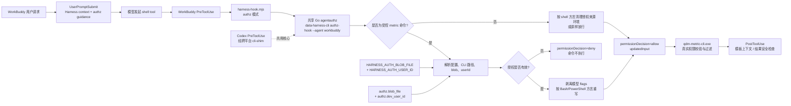
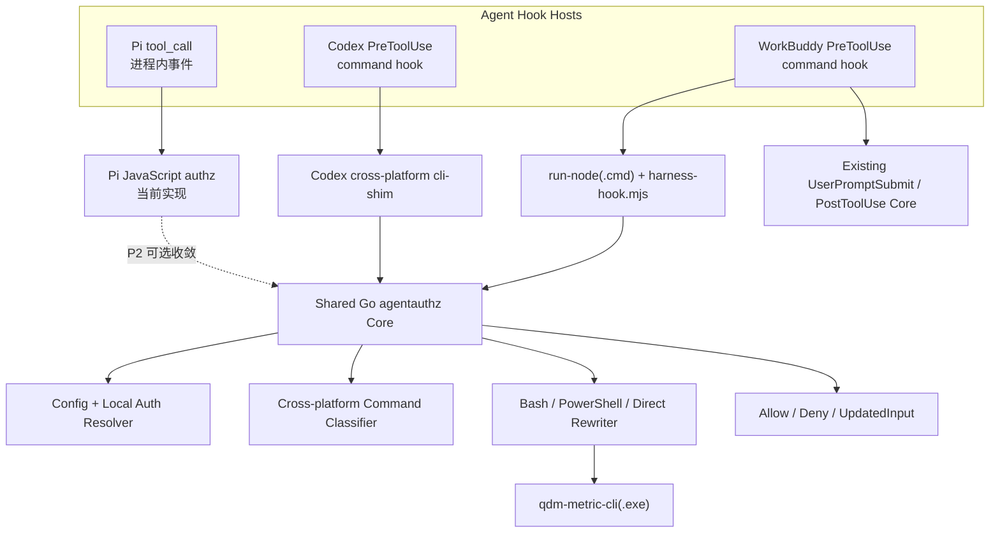

# WorkBuddy 鉴权功能简要修改方案

详细开发拆解、接口契约、逐文件任务和发布计划见 [Windows WorkBuddy 鉴权功能详细实施方案](workbuddy-authz-detailed-implementation-plan.md)。

当前分支的落地结果、测试证据和剩余 WorkBuddy 桌面端验证项见 [Windows WorkBuddy 鉴权实施状态](workbuddy-authz-implementation-status.md)。

## 1. 目标与非目标

目标：让 Windows WorkBuddy 在执行 `qdm-metric-cli analysis execute` 和 `qdm-metric-cli auth describe` 前，安全地绑定当前账号的加密 blob；无法绑定时必须阻断命令。

第一阶段非目标：

- 不在 Harness 中生成、加密或解密 blob。
- 不假设 WorkBuddy 会提供 Pi 的 Host `_auth` 字段。
- 不把 PostToolUse 当作权限边界。
- 不立即统一重写 Pi 的全部 JavaScript 鉴权实现。

## 2. 推荐总体方案

三方 hook 对比后，采用“**WorkBuddy PreToolUse + Codex Go agentauthz 核心扩展**”：

1. WorkBuddy 插件新增 `PreToolUse`，匹配 `Bash|PowerShell|execute_command`。
2. `harness-hook.mjs` 新增 `authz` 模式，保留原始 tool name 和完整 tool_input。
3. 适配器调用 `data-harness-cli authz-hook --agent workbuddy`。
4. Go 鉴权核心根据 tool name/shell dialect：
   - 识别真正的 metric gated command；
   - 移除模型提供的鉴权 flags；
   - 读取管理员分发的本地 blob/userId；
   - 生成目标 shell 的安全命令；
   - 或返回 deny。
5. UserPromptSubmit 负责注入权限使用和范围披露指导；PostToolUse 继续只负责模板/结果安全，不承担注入。

相较初版方案，调整点如下：

- 主参考实现从 Pi 改为 Codex，因为 Codex 和 WorkBuddy 都是 stdin/stdout command hook；Pi 是进程内可变事件扩展。
- Pi 的 Host/Lumi 绑定规则继续作为第二阶段参考，但不复制其 Bash-only JavaScript 重写器。
- WorkBuddy 保留现有 `run-node(.cmd) → harness-hook.mjs → spawnSync(shell:false)` 启动层，不采用 Codex 当前的 installer-time 字符串匹配 patch。
- Codex Windows PreToolUse 未被现有 shim patch 覆盖，必须作为共享核心改造的前置回归项一起修复和验证。

## 3. 前置：WorkBuddy 传输契约验证

在写业务逻辑前，先做两组无真实凭证的最小 smoke。

WorkBuddy contract smoke：

- 注册 `PreToolUse matcher=Bash|PowerShell|execute_command`。
- 记录脱敏后的字段名和 tool name，不记录命令参数中的敏感值。
- 将一个无害命令从 `echo ORIGINAL` 改写成 `echo UPDATED`，确认只执行 UPDATED。
- 返回 deny，确认命令没有任何文件或进程副作用。
- 分别确认三种工具的 command 字段、shell 方言、session_id、cwd 和 updatedInput 返回格式。
- 确认 hook 环境变量与实际工具进程环境的继承关系。

如果 WorkBuddy 不支持执行前 updatedInput 或可靠 deny，则本方案应停止：不能用 PostToolUse 降级实现。此时需要由 WorkBuddy 提供受控工具 wrapper/MCP 入口后再开启 authz。

Codex Windows baseline smoke：

- 确认安装器生成的 PreToolUse 不再包含 POSIX root-search 命令。
- 通过 `cli-shim.mjs authz-hook --agent codex` 实际收到 stdin payload 并返回 updatedInput/deny。
- 验证 Windows 上 hook 启动成功不等于命令方言正确；分别覆盖宿主实际产生的 tool name 和 command。

## 4. 目标架构图

组件关系：

## 5. Shell 方言设计

不能继续把所有工具都归一化成 `Bash`。建议内部定义：

| WorkBuddy tool | 方言 | 典型调用 |
| --- | --- | --- |
| `Bash` | POSIX shell | `'.../qdm-metric-cli' analysis execute ...` |
| `PowerShell` | PowerShell | `& 'C:\...\qdm-metric-cli.exe' analysis execute ...` |
| `execute_command` | 由 contract spike 确定 | 若为 PowerShell，则复用 PowerShell；若为 argv 对象，优先改 argv 而非拼字符串。 |

各方言必须分别实现：

- 可执行文件识别（含 `.exe`、相对路径、绝对路径和空格）。
- quoted text/heredoc/here-string 排除。
- auth flags 删除与插入位置。
- 路径、blob 的安全 quoting。
- pipes、重定向和多命令边界。
- 授权来源环境变量清理。

PowerShell 环境清理不能使用 `unset`，应生成等价的 PowerShell 语句，或在 updatedInput 支持 env 覆盖时直接清空对应 env 字段。`execute_command` 的处理必须以真实 payload 为准，不能猜测其 shell。

Codex 与 WorkBuddy 必须调用同一个 dialect classifier。Codex 不能因为 matcher 名称是 `Bash` 就假设 Windows command 一定具有 POSIX 语义；应以 contract smoke 得到的真实 tool name、command 形态和宿主执行器为准。

## 6. 凭证来源与生命周期

### 第一阶段

与当前 Codex 正式场景对齐，只支持：

1. `HARNESS_AUTH_BLOB` + `HARNESS_AUTH_USER_ID`（调试）。
2. `HARNESS_AUTH_BLOB_FILE` + `HARNESS_AUTH_USER_ID`（管理员分发推荐）。
3. `authz.blob_file` + `authz.dev_user_id`（显式本地配置）。

blob 文件应位于 workspace 外。hook 每次 PreToolUse 读取并验证，避免额外落盘 auth state，也避免把完整 blob 放入 WorkBuddy session state。

### 第二阶段

只有在 WorkBuddy 明确提供可信 Host 身份字段，或能生产与 WorkBuddy 原始 session_id 一致的 Lumi envelope 后，才增加 Host `_auth`/Lumi 来源。届时应复用 Pi 的优先级和 soft/hard failure 规则，并把来源解析收敛到共享 Go 核心。

## 7. 业务代码修改点

### WorkBuddy 插件

- `.agents/workbuddy/hooks/hooks.json`
  - 新增 `PreToolUse`。
  - matcher 为 contract spike 验证通过的 shell 工具集合。
- `.agents/workbuddy/scripts/harness-hook.mjs`
  - 新增 `authz` mode。
  - 不丢弃原始 tool name。
  - 完整保留 tool_input 字段。
  - 校验 PreToolUse allow/deny/updatedInput 输出。
- `.agents/workbuddy/skills/qdm-harness/SKILL.md`
  - 移除“authz.mode=off only”。
  - 增加禁止模型自带 flags、权限范围披露和 auth describe 规则。

### Go CLI

- `cli/internal/agentauthz/hook.go`
  - 支持 `--agent workbuddy`。
  - 接受 WorkBuddy 的原始 tool names。
  - 以 shell dialect 调度分类器和重写器。
- `cli/internal/agentauthz/metric_command.go`
  - 保留 Bash 实现；新增 PowerShell/Windows 路径与 `.exe` 支持。
- `cli/internal/agentauthz/env.go`
  - 按方言生成环境清理，或生成 updatedInput env 覆盖。
- `cli/internal/agentauthz/auth_blob.go`
  - 第一阶段可直接复用 Local Blob 解析；后续再扩展 Host/Lumi。
- `cli/cmd/data-harness-cli/main.go`
  - 保持 `authz-hook` 命令入口，扩展 agent 参数帮助和校验。

### Codex Windows 基线

- `.agents/codex/hooks.json`
  - Windows 安装结果中的 PreToolUse 必须通过 `cli-shim.mjs` 调用 authz-hook，不能保留 POSIX root-search 片段。
- `npm/src/lib/config.js`
  - `patchCodexHooksForWindows` 增加明确的 PreToolUse 转换，或改为结构化 event/args 映射，不再依赖只匹配 `"$cli"`。
- `npm/test/cli.test.js`
  - Windows patch 测试同时覆盖 UserPromptSubmit、PreToolUse、PostToolUse，并验证 agent 参数与 stdin/stdout 传递。

这部分不是 WorkBuddy 功能本身，但它是“共享 Go agentauthz 确实跨平台”的必要基线；否则会产生 WorkBuddy 已修复而 Codex Windows 鉴权仍不可用的分叉。

### WorkBuddy context/posttool

- `cli/internal/context/workbuddy_hook.go`
  - 删除 authz-on 的 UNSUPPORTED 返回。
  - authz-on 时注入“hook 自动绑定、禁止自行传 flags、成功后披露范围”的指导。
  - 缺少稳定 session 时继续 fail safe。
- `cli/internal/posttool/workbuddy_hook.go`
  - 删除 blanket UNSUPPORTED。
  - 保留模板注入和异常 metric 结果的安全提示。
  - 可在 authz-on 的成功结果后追加 scope disclosure 提醒，但不在这里注入凭证。

### npm 安装器与 doctor

- `npm/src/lib/workbuddy.js`
  - 移除 `assertWorkBuddyAuthCompatibility` 拒绝逻辑。
  - 插件完整性检查增加 PreToolUse 声明。
- `npm/src/lib/prompt.js`
  - Windows 不再强制忽略 `--agent workbuddy`；允许 `codex` 和 `workbuddy`，默认策略需产品确认。
- `npm/src/commands/install.js` / `update.js`
  - 允许 WorkBuddy + `--data-auth`。
  - 保留 WorkBuddy 版本和插件启用检查。
- `npm/src/commands/doctor.js`
  - 把 `WorkBuddy authz.mode=off` 检查替换为 PreToolUse、blob 来源、userId、CLI 路径和插件版本检查。

## 8. 安全不变量

实现必须满足：

1. 未绑定 blob/userId 时，gated command 必须 deny，不能只返回 additionalContext。
2. 模型提供的 `--auth-blob`、`--auth-json`、`--data-auth` 必须被删除并替换。
3. 非命令文本、提交信息、引号内容、here-string 不得误改。
4. 完整 blob 不写 stderr、systemMessage、additionalContext、诊断日志或普通状态文件。
5. 授权来源 env 不得无条件传递给普通 shell 命令。
6. `auth describe` 只注入 `--auth-blob`；`analysis execute` 同时注入 `--data-auth`。
7. session_id 缺失时，context、PreToolUse 和 PostToolUse 都 fail safe。
8. PreToolUse transport 未验证通过前，安装器继续拒绝 WorkBuddy + authz-on。

## 9. 测试矩阵

至少增加以下测试：

- Adapter contract：PreToolUse payload 保真、其他 tool_input 字段保留、allow/deny 输出校验。
- Bash：沿用现有 quoted/heredoc/pipe/模型 flags 用例。
- PowerShell：调用运算符 `&`、`.exe`、带空格路径、单/双引号、pipeline、分号、here-string。
- `execute_command`：按真实宿主 payload 增加回归用例。
- 安全：无 blob、blob 非 `qdm1enc`、无 userId、`allow_local_blob=false`、模型 fixture flags。
- 环境隔离：普通命令看不到 auth source env；gated 命令仍能使用已绑定 blob。
- WorkBuddy E2E：原命令不执行、updated command 执行、deny 零副作用。
- Codex Windows E2E：PreToolUse 经 shim 启动、完整 stdin/stdout 传递、真实 updatedInput/deny 生效。
- Installer/doctor：Windows 选择 WorkBuddy、data-auth 安装、插件 PreToolUse 声明、版本和启用状态。
- 回归：authz-off 时 WorkBuddy context/template 主链路保持不变。

## 10. 实施顺序

1. P0：完成 WorkBuddy PreToolUse/updatedInput/deny contract spike。
2. P0：修复并验证 Codex Windows PreToolUse 的 cli-shim 启动链。
3. P1：扩展共享 Go agentauthz，先打通 PowerShell Local Blob。
4. P1：扩展 WorkBuddy adapter，解除 context/posttool、installer、doctor 的 authz 禁用。
5. P1：完成 Windows WorkBuddy + Codex E2E 和安全负向测试。
6. P2：支持 Bash/execute_command 的完整矩阵。
7. P2：评估 Host `_auth`/Lumi envelope，并决定是否将 Pi 收敛到 Go 核心。

## 11. 验收标准

- WorkBuddy Windows 中，authz-on 的两类 gated command 均在执行前被正确改写。
- 无凭证、伪造 flags、无 session 时命令不执行。
- authz-off 行为与当前版本一致。
- 普通 shell 无法继承授权来源 env。
- 用户看到的数据结论明确标注账号数据权限范围，范围来自 `auth describe`。
- npm、Go 单测和真实 WorkBuddy desktop E2E 全部通过后，才移除“WorkBuddy authz 不支持”的发布限制。
- Codex Windows PreToolUse 同时通过 E2E，确保共享核心没有形成新的 Agent 分叉。
