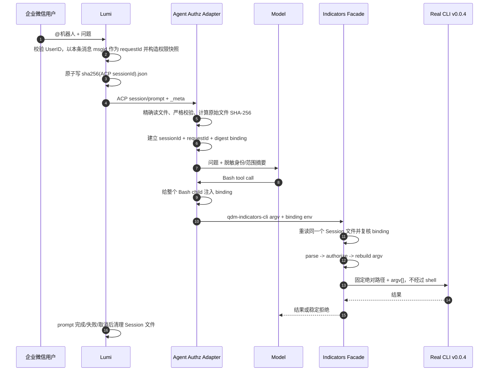

# Lumi × Harness Data：多 Agent / Indicators CLI 请求级权限受控试点方案

## 1. 文档信息

- 状态：技术方案定稿，待按本文实施
- 更新日期：2026-07-30
- 适用项目：`harness-data`
- 部署场景：Harness Data 运行在 Lumi 管理的 Docker Sandbox 中，并由企业微信机器人提供服务
- 授权 Agent：Pi、Claude Code、Codex、Qwen Code（每个部署只选择一个）
- 首发数据入口：仅 `qdm-indicators-cli`
- 固定真实 CLI：`pengmide/qdm-indicators-cli` v0.0.4
- Lumi 基线：PR #1，merge commit `869d76e3f894a9b2b9f9a7eef459131097bfb3df`
- 授权模式：`lumi-mvp-required`

本文描述的是受控试点中的功能性权限护栏。它保证经公开 Indicators CLI 入口发起的查询都会经过请求级权限校验和参数重建，但不把 Agent、Facade、真实 CLI、凭证和网络仍处于同一 UID/root 信任域的部署描述为生产级、不可绕过的安全边界。

## 2. 结论与范围

### 2.1 固定结论

1. Lumi 的 `RequesterContext V1` 是首发版本唯一的身份与权限来源，不在 Harness 中再次查询或合并另一份人员权限。
2. 权限上下文必须随每条企业微信消息重新生成，并随该次 ACP `session/prompt` 传递；不得在 `session_start` 时建立授权并跨消息复用。
3. Harness 授权适配 Pi、Claude Code、Codex 和 Qwen Code。OpenClaw、Hermes 及其他 Agent 不在授权 profile 范围内。
4. 公开的 `bin/qdm-indicators-cli` 改为 Facade；真实 v0.0.4 CLI 使用固定私有绝对路径执行，不进入 Agent 的 `PATH`。
5. 每个 shell tool call 都携带当前请求的私有绑定：Pi 使用按 `toolCallId` 隔离的 `spawnHook`，Claude Code/Codex/Qwen Code 使用 `PreToolUse.updatedInput`。Facade 每次启动都重新读取 Lumi 的精确 Session 文件并核验绑定，不能只信任提示词、进程缓存或环境变量。
6. 受保护维度固定为 `manageAreaId` 和 `categoryLevel1Id`。
7. 请求未指定受保护维度时，注入该维度的全部授权值；指定授权子集时保留该子集；包含任一越权值时拒绝整条查询，不做静默裁剪。
8. 同一维度内部是 OR，两个维度之间是 AND；V1 两个数组表达的是笛卡尔积权限。
9. 只有同时支持两个受保护维度、且被收入固定指标目录的指标可以执行。多指标查询中的每个指标都必须满足该条件。
10. 首发仅允许 `analysis execute` 的受控参数子集和明确列出的只读元数据命令。CMR、SQL、业务阈值、raw payload、报表执行/导出以及公开 token/config 操作全部关闭。
11. 授权模式由只读 `/etc/harness-data/authz.json` 明确启用，不能因为检测到 `LUMI_REQUESTER_CONTEXT_DIR` 或目录中存在文件而自动启用。
12. 企业微信群回复对全体群成员可见。试点阶段明确接受这一传播边界；本方案只校验本次提问者是否在 Lumi 启动时加载的用户白名单及其权限快照中，不实现群成员权限求交、私聊回传或 DLP。

### 2.2 首发范围

首发支持：

- Lumi 每条企业微信消息到 ACP `session/prompt` 的 `RequesterContext V1` 传播。
- Pi、Claude Code、Codex、Qwen Code 的请求级绑定、脱敏提示摘要和 shell child 环境传播。
- Indicators Facade 的严格解析、授权判断、参数重建、固定二进制执行和审计。
- `analysis execute`。
- `indicator search`、`dim search`、`dim values`、`wikis --code` 和 v0.0.4 的只读 `dictionary` 命令。
- 受保护维度元数据结果过滤。
- Lumi Sandbox 中的安装、就绪检查、失败关闭和端到端验证。

首发不支持：

- `qdm-cmr-cli`、`qdm-sql-cli` 或任何等价数据旁路。
- `--biz-thresh`。
- `--payload`、`--payload-json`。
- `analysis preview`、`analysis total`。
- `report list`、`report cards`、`report execute-card`、`report export-card`。
- `config set-token`、`config check-token` 或其他公开凭证操作。
- 不在本文 allowlist 中的命令、flag、位置参数或未来 CLI 语法。
- OpenClaw、Hermes 及未进入授权 Agent allowlist 的其他 Agent。
- 抵御同 UID/root Agent 主动读取或篡改文件、直接访问网络、复制真实二进制或读取运行时凭证。

## 3. 已有事实与设计约束

### 3.1 Lumi 已完成的能力

Lumi PR #1 已实现：

- 根据企业微信 `UserID` 从启动时加载的 JSON 白名单构造 `RequesterContext V1`。
- 每条企业微信消息重新校验并构造权限快照。
- Local 与 Sandbox 均在每次 ACP `session/prompt` 中写入 `_meta.lumi.requesterContext`。
- 同时写入：

  ```text
  $LUMI_REQUESTER_CONTEXT_DIR/<sha256(raw ACP sessionId)>.json
  ```

- Session 文件目录权限为 `0700`、文件权限为 `0600`，使用临时文件加原子 rename 发布。
- envelope 默认有效期为 30 分钟，并在 prompt 完成、失败，或取消使 `session/prompt` 返回后通过 defer 清理对应文件。
- 清理函数通过 `os.Stat/os.SameFile` 校验文件身份，只移除自己发布的文件，不会误删同一 Session 后续请求覆盖的新文件。

Lumi 不提供签名、MAC 或独立可信 broker。Session JSON 是兼容传递介质，不是安全凭证。

### 3.2 Harness 当前约束

- Harness prompt hook 读取 Agent hook payload 的 `session_id` 和 `prompt`，不会自动消费 ACP `_meta`；对应 Lumi/ACP adapter 必须保证该 `session_id` 与原始 ACP session ID 完全一致。
- Pi 的 `context` 事件会随当前用户消息构造模型上下文；Claude Code、Codex、Qwen Code 使用 `UserPromptSubmit`。静态 session/start hook 不能用于每条消息换绑。
- Pi 使用 `tool_call` + `createBashTool(..., spawnHook)` 给 Bash child 注入绑定；Claude Code、Codex、Qwen Code 使用 `PreToolUse.updatedInput` 在每次 shell 调用前重新绑定并重写命令。
- Harness 本身不直接执行查询；数据请求由 Agent 生成 shell 命令后调用外部 CLI。
- 当前 npm 安装器会把 Indicators CLI 放到公开 `bin`，配置还会记录其绝对路径；若不同时修改 installer、updater 和配置生成逻辑，单纯调整 `PATH` 无法保证命中 Facade。
- 当前 prompt-time auth preflight 可能调用 CAS 刷新 token。授权部署中必须移除此 Agent 可见的刷新路径。

### 3.3 安全定位

首发方案能防止：

- 模型遗漏区域或品类过滤。
- 模型在受支持命令中请求超出本次用户权限的 ID。
- 旧请求绑定在 Session 文件已清理、已替换或已过期后继续经 Facade 查询。
- 通过重复 flag、raw payload 或未适配子命令绕过参数重建。
- 安装器升级时无意用真实 CLI 覆盖 Facade。

首发方案不能防止：

- 同 UID/root 的 Agent 主动篡改 Session JSON、绑定环境或本地文件。
- Agent 读取真实 CLI/凭证后绕过 Facade。
- Agent 使用 `curl` 或其他程序直连 Indicators 网络。
- 完整 prompt injection 控制同一信任域中的所有可见能力。
- 已授权结果发到群后被群内其他成员看到。

因此试点只能面向批准的用户、群、指标和数据范围。若后续要求生产级强制边界，真实 CLI、凭证和 Indicators 网络访问必须移到 Agent 信任域之外的 host-owned broker/sidecar，并使用不可伪造、可撤销的请求绑定；该演进不属于本次实施。

## 4. 总体架构

### 4.1 主链路

```text
企业微信消息
  -> Lumi 校验 UserID，并为本条消息创建新的 RequesterContext V1
  -> ACP session/prompt._meta + Session JSON
  -> Agent prompt/context hook 使用精确 sessionId 文件名读取 envelope
  -> 严格校验 envelope
  -> 创建 HarnessAuthzBinding V1；Pi 保存在扩展私有状态，标准 Hook Agent 按事件即时返回
  -> 仅向模型注入脱敏的身份/范围摘要
  -> Agent shell hook 给本次 Bash child 注入 binding 环境
  -> 公开 bin/qdm-indicators-cli Facade
  -> 每次 invocation 重新读取并校验当前 Lumi envelope
  -> 严格解析、授权、重建 argv
  -> 固定私有路径执行真实 qdm-indicators-cli v0.0.4
```

### 4.2 模块职责

| 模块 | 责任 | 明确不负责 |
| --- | --- | --- |
| Lumi WeCom / ACP Host | 校验本条消息的企业微信用户；创建 V1 权限快照；发布 `_meta` 和 Session JSON；结束后清理 | 不修改 CLI 参数 |
| Pi `context` / `tool_call` adapter | 取得当前 Pi session ID；读取精确文件；维护按 session/toolCallId 隔离的 binding；通过 `spawnHook` 注入每个 Bash child | 不从自然语言推断用户；不扫描上下文目录 |
| Claude/Codex/Qwen Hook adapter | `UserPromptSubmit` 注入脱敏摘要；每次 `PreToolUse` 重新绑定并通过 `updatedInput` 重写 Bash 或 `run_shell_command` | 不跨 Hook 进程缓存 binding；不接受 Agent 自报 envelope 路径 |
| Indicators Facade | 每次调用复核 binding 与当前 envelope；解析 operation；校验 capability/scope/catalog；重建 argv；执行真实 CLI | 不接受模型自报用户、scope、Session 文件路径或真实 CLI 路径 |
| 指标目录 | 固定允许执行的指标，并证明每个指标支持两个受保护维度 | 不在运行时自动跟随线上 metadata 变化 |
| 真实 Indicators CLI | 使用 Facade 重建的 argv 访问 Indicators API | 不进入 Agent `PATH`；不公开 config/token 子命令 |
| 部署与 updater | 固定版本、hash、路径、配置和凭证；执行 readiness | 不独立追踪 Indicators 最新 release |

### 4.3 请求时序



## 5. 上下文与绑定合同

### 5.1 `RequesterContext V1`

Harness 只接受 Lumi 已合并的 V1 schema：

```json
{
  "version": 1,
  "requestId": "req-01J...",
  "policyRevision": "sha256:<64-lowercase-hex>",
  "principal": {
    "channel": "wecom",
    "botId": "bot-id",
    "canonicalUserId": "zhangsan",
    "displayName": "张三"
  },
  "audience": {
    "chatId": "chat-id",
    "chatType": "group"
  },
  "authorization": {
    "capabilities": ["qdm.indicators.query"],
    "scope": {
      "manageAreaIds": ["CN07", "CN08"],
      "categoryLevel1Ids": ["12", "13"]
    }
  }
}
```

字段规则：

- `requestId` 是 Lumi trim 后的企业微信 `msgid`，必须非空。不同入站消息应由企业微信提供不同 `msgid`；同一消息触发的 Lumi 自动 continuation 复用原 `requestId`。
- `principal.channel` 必须是 `wecom`。
- `policyRevision` 必须符合 `sha256:<64 lowercase hex>`；`botId`、`canonicalUserId`、`chatId` 和 `requestId` 必须非空。
- `displayName` 只用于提示和审计展示，不参与授权判断。
- `chatType` 是审计字段，但 Lumi wire schema 不保证非空，不能把非空或 `group` 当作 V1 授权前提。试点入口与 E2E 固定为企微群；若未来要按会话类型授权，必须先补强 Lumi wire 合同。
- 必须包含 `qdm.indicators.query` capability。
- scope ID 在业务语义上是 opaque string。Lumi 已在加载白名单时 trim；Harness 对 wire 中仍带首尾空白的 ID 直接拒绝，其他值按原字节和大小写精确比较，不做 Unicode 归一化，不接受 wildcard。由于 v0.0.4 的 filter wire format 用逗号分隔 ID，任何包含逗号、NUL 或控制字符的授权 ID 都不可无歧义表达，必须 fail closed，不能先 join 再交给真实 CLI。
- 任一受保护维度为空、包含空 ID 或无法解析时均为 deny-all。
- `policyRevision` 只用于版本关联和审计，不是签名。

### 5.2 Lumi Session envelope

磁盘文件使用 Lumi V1 envelope：

```json
{
  "version": 1,
  "workspaceId": "workspace-id",
  "agentId": "agent-id",
  "sessionId": "raw-acp-session-id",
  "issuedAt": "2026-07-30T01:00:00Z",
  "expiresAt": "2026-07-30T01:30:00Z",
  "requesterContext": {}
}
```

定位规则固定为：

```text
requesterContextDir + "/" + hex(sha256(raw ACP sessionId bytes)) + ".json"
```

不得对 session ID 做 trim、大小写转换、Unicode 归一化或路径字符替换。不得扫描目录、选择最新文件、选择唯一文件，也不得维护进程级“当前用户”。

### 5.3 严格读取规则

Pi adapter 与 Facade 必须遵循同一严格读取合同。实施上由 Pi 调用 Harness 内部 authz helper，复用 Facade 所在 Go package 的 reader；两条入口还必须共享同一批 golden vectors，避免 TypeScript 与 Go 各自解释 schema。

1. 从只读授权配置取得期望的绝对 context 目录，只打开按原始 session ID 计算出的唯一文件。
2. 拒绝 symlink、非普通文件、超出配置上限的文件和路径逃逸。
3. 使用严格 JSON decoder：拒绝未知字段、重复 key、错误类型、尾随 token 和多个 JSON value。
4. 要求 envelope 与 requester context 的 `version` 都为 `1`。
5. `sessionId` 必须与调用方提供的原始 session ID 字节完全一致。
6. `workspaceId`、`agentId`、`sessionId`、`requestId`、`policyRevision`、`principal.channel`、`principal.botId`、`principal.canonicalUserId` 和 `audience.chatId` 必须非空；`displayName` 和 `chatType` 可以为空，另由部署策略决定是否收紧。
7. `issuedAt`、`expiresAt` 必须可解析，并满足 `issuedAt <= now + configuredClockSkew`、`now < expiresAt` 和 `0 < expiresAt - issuedAt <= min(configuredMaxEnvelopeTTL, 30m)`。时钟偏差不能用于延长过期时间。
8. capability 和两个 scope 数组必须满足 V1 规则；`audience.chatType` 原样保留用于审计，不参与本期 allow/deny。
9. 对读取到的完整原始文件字节计算 SHA-256；不要对重新序列化后的 JSON 计算摘要。
10. 任一步失败都清除该 session 的 Pi 私有 binding，并使后续数据 CLI fail closed。

### 5.4 `HarnessAuthzBinding V1`

绑定是 Pi adapter 对“刚刚校验过的精确 envelope”的私有引用：

```json
{
  "version": 1,
  "sessionId": "raw-acp-session-id",
  "requestId": "req-01J...",
  "envelopeSha256": "64-lowercase-hex",
  "expiresAt": "2026-07-30T01:30:00Z"
}
```

绑定键为：

```text
sessionId + requestId + envelopeSha256
```

行为要求：

- Pi 扩展按 session ID 保存 binding，并在相邻私有状态中保存经版本化 canonical encoder 计算的完整 typed `RequesterContext V1` 指纹；不能使用全局单例。
- authz 刷新必须在每次 Pi `context` 事件中、且独立于现有 wiki `ContextCache` 执行。wiki cache key 不能决定是否刷新授权摘要或 binding。
- 第一次看到新 `requestId` 时创建新 binding；同一 request、同一完整 envelope digest 的重复 `context` 事件幂等复用。
- Lumi 自动 continuation 会在同一 session、同一 requestId 下重新发布 envelope，并更新 `issuedAt/expiresAt`。若 requester-context 指纹完全相同且新 envelope 自身通过当前时间/TTL 校验，Pi 将其视为合法 continuation，原子替换为新的完整 digest/expiry binding。
- 同一 `sessionId + requestId` 下 requester-context 指纹变化或新 envelope 自身无效时，视为竞态/篡改，清除 binding 并拒绝。Lumi V1 没有 publication nonce/sequence，也不承诺 wall clock 单调，因此 Harness 不能靠相对时间判断重放；若未来要防同 UID 主动回放仍有效的旧 envelope，必须先升级 Lumi 合同。
- 同一 Session 的下一条入站消息应使用新的 msgid/requestId，并原子替换旧 binding；Harness 不能仅凭内容相同或不同推断消息身份。
- 多个 session 可以并发，各自只读取和携带自己的 binding。
- Adapter 不主动把 binding 写入模型提示词、Harness wiki context 或对话历史，正常提示只包含脱敏摘要。同信任域 Agent 仍可通过执行 `env` 等命令观察 child 环境，因此不能承诺 binding 对模型不可读。
- binding 不是 secret，也不是签名；它的作用是让正常调用链精确关联当前文件，并让 stale/cleanup/replacement 可被 Facade 检出。requester-context 指纹只留在 Pi 私有状态，不需要传给 Facade。

### 5.5 Agent Session ID 前置验证

实施前必须先在真实 Lumi Sandbox 针对所选 Agent 跑 smoke test，证明：

```text
Agent hook/context session ID === ACP session/prompt.params.sessionId
```

测试必须覆盖新 Session、恢复 Session、同一 Session 的第二条入站消息和同一消息的自动 continuation。

Pi 使用 `ctx.sessionManager.getSessionId()`；Claude Code、Codex、Qwen Code 使用 Hook payload 的原始 `session_id`。如果不相等，必须修改 Lumi 到对应 Agent 的 ACP adapter，显式传播 ACP session ID；在该能力完成前，该 Agent 的 `lumi-mvp-required` 部署不得接流量。禁止用扫描 context 目录、取最新文件或猜测映射作为 fallback。

### 5.6 模型可见摘要

Pi `context` 或标准 Agent 的 `UserPromptSubmit` 可追加如下语义摘要：

```text
Requester: wecom / bot-id / zhangsan
Authorized manageAreaIds: CN07, CN08
Authorized categoryLevel1Ids: 12, 13
Data rule: use only qdm-indicators-cli; the Facade applies final authorization.
```

摘要帮助模型形成更合适的查询，但不参与 Facade 的最终授权。摘要不得包含原始 envelope、文件路径、digest、凭证或可执行绑定。

### 5.7 Shell child 传播

Pi 固定并验证 `0.81.1` 的扩展合同。虽然 `tool_call` input 本身只有 `command/timeout`，该版本支持通过 `createBashTool(..., spawnHook)` 注册同名的 auth-aware Bash tool，并在真正 spawn child 时提供环境。Pi 路径不得用 shell 字符串拼接模拟环境注入。

Pi adapter 对每个 `bash`/`Bash` 调用执行：

1. `tool_call` 先完成现有 posttool command mutation，再按 `toolCallId` 捕获当前 session 的私有 binding。
2. 将 `HarnessAuthzBinding V1` 按 RFC 8785/JCS canonical JSON 编码，再做无 padding 的 base64url，得到单个环境值：

   ```text
   HARNESS_AUTHZ_BINDING_V1=<base64url(JCS(binding-json))>
   ```

3. 同名 Bash override 的 `execute(toolCallId, ...)` 取得一次性映射，并为本次调用构造闭包化的 `createBashTool(..., spawnHook)`（或使用等价的 AsyncLocalStorage）；固定的全局 spawnHook 不能读取全局 `currentBinding`。本次 spawnHook 只给对应 child 设置该值，管道、子 shell、脚本和后台进程正常继承。
4. child 创建后清除一次性 toolCallId 映射。并发 tool call 不能读取彼此的 binding。
5. 若当前 session 没有有效 binding，普通 Bash 仍可运行，但 spawnHook 必须显式删除父环境中可能残留的 `HARNESS_AUTHZ_BINDING_V1`；任何 Facade 数据调用都会拒绝。
6. `session_shutdown`、下一次 `context` 换绑和读取失败负责 best-effort 清理 Pi 状态。Pi 0.81.1 没有在本文中已确认的请求取消授权事件；prompt 取消后的权威失效依据是 Lumi `FileBridge` defer cleanup，而不是假设 Pi 一定回调。

Claude Code、Codex 和 Qwen Code 不复用 Pi 的进程内状态，按以下合同执行：

1. `UserPromptSubmit` 使用 payload 的原始 `session_id` 调用 `authz-hook`，重新读取 envelope 并只返回脱敏摘要。
2. 每次 `PreToolUse` 再次调用 `authz-hook`；Claude Code/Codex 匹配 `Bash`，Qwen Code 匹配 `run_shell_command`。
3. Hook 通过 `permissionDecision=allow` 和完整 `updatedInput` 保留原工具参数，只把 `command` 改写为：先删除 CMR/SQL/CAS 旁路环境，固定公开 Facade，导出单个 JCS/base64url binding，再执行原命令。
4. Hook 不跨进程缓存 binding；prompt 摘要与每个 shell 调用均独立重新绑定。读取、session ID、配置或 kill switch 校验失败时，`UserPromptSubmit` 返回 `decision=block`，`PreToolUse` 返回 `permissionDecision=deny`。
5. 该命令前缀会保持同一 shell 中的脚本、管道、子 shell 和后台进程继承语义，但部署必须分别用真实 Claude Code、Codex、Qwen Code runtime 验证 `updatedInput`、退出码、stdout/stderr 和取消行为。
6. 当前命令前缀使用 POSIX `unset`、`export` 和单引号转义；在 Windows Hook shell 合同完成实现与真实 runtime 验证前，Windows 的 `lumi-mvp-required` 只允许 Pi。

base64url 只解决环境传输与字符边界，不提供保密或完整性保护。Adapter 不把完整 requester context 放进环境，也不允许模型通过 CLI flag 提交 `--user`、`--request-id`、`--session-id`、scope、digest 或 context 文件路径。

## 6. Facade 每次调用的校验流程

公开 `qdm-indicators-cli` 每次 invocation 都执行：

```text
读取 /etc/harness-data/authz.json
  -> 要求 mode=lumi-mvp-required
  -> 重开 host control 文件，要求 state=enabled
  -> 严格解码 HARNESS_AUTHZ_BINDING_V1，检查 JCS/base64url 和字段
  -> 用 binding.sessionId 计算唯一 Session 文件名
  -> 严格读取当前 envelope
  -> 比较 sessionId
  -> 比较 requesterContext.requestId
  -> 比较完整 envelope 原始字节 SHA-256
  -> 比较 expiresAt，并再次检查当前时间
  -> 检查 qdm.indicators.query capability
  -> 检查两个 scope 非空
  -> 解析 argv 为 typed operation
  -> 授权 operation，重建 canonical argv
  -> 校验固定真实 CLI 版本和 artifact digest
  -> execve/exec.CommandContext(固定绝对路径, argv[])，不经过 shell
```

比较必须同时满足：

```text
binding.sessionId       == envelope.sessionId
binding.requestId       == envelope.requesterContext.requestId
binding.envelopeSha256  == sha256(current raw envelope bytes)
binding.expiresAt       == envelope.expiresAt
now                     <  envelope.expiresAt
```

这一步必须在每个 metadata 或 query invocation 中重复，不能以 Pi 已验证、进程内缓存仍存在或上一条命令刚成功为由跳过。

### 6.1 并发与生命周期结果

| 场景 | 结果 |
| --- | --- |
| 同一 request/envelope 多次 CLI 调用 | 每次重读同一文件并独立校验，允许且分别审计 |
| 同一消息自动 continuation | requester-context 指纹不变且新 envelope 自身有效时换绑；旧 child 因 digest 不匹配而拒绝 |
| 同一 Session 下一条入站消息 | 新 msgid/requestId/digest 替换 binding；旧 child 因 digest/request 不匹配而拒绝 |
| Lumi 已完成并清理 prompt | 文件不存在，拒绝 |
| 请求取消 | `session/prompt` 返回并执行 defer cleanup 后拒绝；Pi 同时尽力清除内存 binding |
| binding 过期 | 拒绝，即使文件仍存在 |
| binding 建立后文件意外变化 | digest 不匹配，拒绝 |
| 两个 Session 并发 | 按各自 sessionId 文件和私有 binding 隔离 |
| 同一 Session 文件发生竞态覆盖 | 只允许完整匹配的一方；另一方失败，不得串用另一用户 scope |

正常 WeCom 链路会对同一 conversation 串行处理；同群不同用户的 conversation/session key 包含 `chatId + canonicalUserId`，通常使用不同 Session 文件。表中的同 Session 覆盖属于异常防御场景；自动 continuation 则是必须支持的合法顺序重发布。

### 6.2 真实 CLI 子进程边界

Facade 不能把 Agent 的原始环境直接传给真实 v0.0.4 CLI。该 CLI 会读取 `QDM_INDICATORS_TOKEN`、`QDM_INDICATORS_CONFIG_DIR`、`LUMI_WORKSPACE_PATH` 和 `HOME`，Go 默认 HTTP transport 还可能读取 proxy/CA 环境；直接继承会让模型改变凭证来源、配置或网络路由。

每次执行必须：

- 从空环境构造 child env，只加入固定 locale/timezone 和由 root-owned authz config 指定的 `QDM_INDICATORS_CONFIG_DIR`；如部署需要自定义 CA，也只能加入配置中固定且校验过的 CA 路径。
- 明确移除 Agent 提供的 token、workspace、`HOME`、proxy、动态 loader 和其他未列入 allowlist 的变量。
- 使用配置中的固定 cwd，将 stdin 连接到 `/dev/null`，创建独立进程组。
- stdout/stderr 先进入有界缓冲；只有真实 CLI 成功退出、输出未超限且 metadata 后处理成功后才进入待返回状态。失败、超时或超限时杀死整个进程组并抑制部分结果。
- 执行期间按 kill-switch poll 周期同时重开 control 文件和精确 Lumi Session 文件，重新比较 binding 的 session/request/digest/expiry；任一失效都终止进程组并丢弃缓冲结果。
- 即使周期检查刚通过，也必须在向 Agent 释放任何 stdout 前做一次最终 binding/envelope/expiry/control 复核。只有最终复核仍通过才原子返回完整缓冲结果。

这些约束仍不能抵御同 UID/root Agent 主动读取运维凭证，但可以避免正常 Facade 调用被 child env 污染。

## 7. CLI 合同

### 7.1 公私入口

Lumi 授权部署中的路径必须是：

```text
<workspace>/bin/qdm-indicators-cli
  -> Harness-owned Facade

/opt/harness-data/private/qdm-indicators-cli-v0.0.4
  -> fixed real CLI, not in PATH
```

以下两个现有入口都必须指向 Facade：

- 环境变量 `QDM_INDICATORS_CLI`。
- Harness 配置中由 `npm/src/lib/config.js` 生成的 Indicators CLI 绝对路径。

Facade 自己只从 `/etc/harness-data/authz.json` 读取真实 CLI 绝对路径。child env、用户配置、工作区文件和 argv 都不能覆盖该路径。

### 7.2 允许的 `analysis execute`

命令骨架：

```text
qdm-indicators-cli analysis execute [approved flags]
```

允许的 v0.0.4 flag：

| flag | 类型 | 规则 |
| --- | --- | --- |
| `--start-date` | scalar string | 必填，`YYYY-MM-DD`，受最大日期跨度限制 |
| `--end-date` | scalar string | 必填，`YYYY-MM-DD`，不得早于 start |
| `--indicator` | repeatable string | 至少一个；每个都必须在固定目录且支持两个保护维度 |
| `--agg-dim` | repeatable string | 使用 v0.0.4 原生命名；数量和值受部署限制 |
| `--column-agg-dim` | repeatable string | 使用 v0.0.4 原生命名；数量和值受部署限制 |
| `--filter` | repeatable `code=id1,id2` | 严格解析；两个保护维度按第 8 节处理 |
| `--other-filter` | repeatable `code=id1,id2` | 允许非保护维度；保护维度 code 一律拒绝 |
| `--measure-filter` | repeatable `indicator:operator:value` | indicator 必须属于本次批准的 `--indicator`；operator 只允许 `< <= = > >=`；value 必须为有限数值 |
| `--indicators-group` | scalar int | 只允许 `1` 或 `2` |
| `--store-collect-type` | scalar int | 只允许 `1` 或 `2` |
| `--page-size` | scalar int | 正数且不超过部署上限；省略时注入受控默认值 |
| `--curr-page` | scalar int | 正数 |
| `--order-by` | scalar string | 仅允许一个本次输出字段加 `ASC`/`DESC`，例如 `saleAmt DESC` |
| `--chart-type` | scalar string | 只允许 `table` |
| `--single-page` | bool | 允许；首发 canonical argv 无论输入是否省略都强制为 true |
| `--ai` | bool | 允许 |
| `--yoy` | bool | 允许 |
| `--mom` | bool | 允许 |

解析器必须与 v0.0.4 的实际长 flag 语法做合同测试，包括其支持的 `--name value`、`--name=value` 和 bool 形式；“v0.0.4 能解析”只是语法前提，不代表该值已获授权。Facade 还要逐项执行上表的更严格值级校验：字符串有长度上限且不得含控制字符，日期和数值有明确边界，`order-by` 字段必须来自本次 `indicator/agg-dim/column-agg-dim` 的可输出字段集合。

重复语义固定为：

- scalar flag 重复一律拒绝。
- `indicator`、`agg-dim`、`column-agg-dim` 保留输入顺序，但其中任何重复值都拒绝；同一维度同时出现在行、列聚合中也拒绝。
- 普通 `filter` 和 `other-filter` 的同一 code 只能出现一次；其 ID 列表内重复值拒绝。
- `measure-filter` 保留输入顺序；完全重复的条件拒绝，同一指标的不同合法上下界可以共存。
- 缺值、额外位置参数、未知 flag、未知子命令和无法唯一解析的写法一律拒绝。

首发始终显式生成 `--single-page` 和不超过配置的 page size，从而不触发 v0.0.4 默认自动遍历全部页面的行为。显式 `--single-page=false` 因与部署策略冲突而拒绝；`--curr-page` 仍允许选择某一页。每次调用继续受 binding、超时和有界输出校验。

区域和一级品类是本期仅有的权限维度。其他聚合维度和非保护 filter 会在已授权区域×品类行集内继续生效，但本方案不为手机号、人员、供应商等其他维度提供额外数据治理；首批 playbook/维度范围必须由试点 owner 单独签收。

### 7.3 明确拒绝的语法

以下输入即使真实 v0.0.4 可以处理，Facade 也必须拒绝：

- `--payload`、`--payload-json`。
- `--biz-thresh`。
- `analysis preview`、`analysis total`。
- 所有 `report` 执行、读取和导出路径。
- 所有公开 `config`/token 路径。
- 不在 allowlist 中的未来 flag 或子命令。
- CMR、SQL 或用其他命令模拟相同数据查询的路径。

Facade 不做字符串替换，也不把改写后的 shell 命令交还 Agent。它先将所有输入解析为 typed operation，再从该结构生成完整 `argv[]`。

### 7.4 允许的只读元数据命令

所有元数据命令同样要求当前有效 binding 和 `qdm.indicators.query` capability。

| 命令 | 首发允许 flag |
| --- | --- |
| `indicator search` | `--keyword`、`--ai` |
| `dim search` | `--keyword`、`--ai` |
| `dim values` | `--code`、`--keyword`、`--limit`、`--ai` |
| `wikis` | 仅必填 `--code` |
| `dictionary list` | `--keyword`、`--page`、`--limit`、`--query-type`、`--ai` |
| `dictionary detail` | 必填 `--id`，可选 `--query-type` |
| `dictionary versions` | 必填 `--id`，可选 `--ai` |
| `dictionary change-log` | 必填 `--code`，可选 `--ai` |
| `dictionary id-by-name` | 必填 `--name`，可选 `--query-type` |
| `dictionary dict` | 必填 `--type`，可选 `--ai` |
| `dictionary statuses` | `--ai` |

所有 v0.0.4 metadata 命令中的 `--full`，以及 `dictionary list` 的 `--status`、`--level`、`--biz-id`、`--report-id`、`--menu-id`、`--sort`，在首发一律拒绝。这些命令只允许读取，不允许保存文件、修改配置或执行报表。

值合同固定为：`--limit/--page` 是受配置上限约束的正整数；`--query-type` 只允许 `1/2`；`dictionary dict --type` 只允许 `1..6`；`--keyword` 有字节长度上限且不得含控制字符；detail/versions 的 `--id`、change-log 的 `--code` 和 id-by-name 的 `--name` 必须在批准指标目录中有唯一精确映射。所有参数从 typed operation 重建，未列出的 metadata flag 拒绝。

### 7.5 保护维度的 metadata 输出

当执行：

```text
dim values --code manageAreaId ...
dim values --code categoryLevel1Id ...
```

Facade 必须解析真实 CLI 返回的 JSON 或 JSONL，只保留 `dimFieldId` 精确属于当前授权集合的记录，再输出给 Agent。此外，所有允许的 metadata 都经过固定投影，不能直接透传真实 CLI stdout。要求：

- 先按当前 binding 校验授权，再调用真实 CLI。
- wire ID 带首尾空白时拒绝；其他 ID 保持大小写精确比较。
- 无权 ID 的名称及其他字段也不得输出。
- scope 为空时不调用真实 CLI，直接拒绝。
- 输出不是预期结构、缺少可验证 ID、解析失败或超出大小上限时 fail closed，不透传原始结果。
- `dim search` 对保护维度只返回维度定义字段，移除 `dimFieldId/dimFieldValue` 等值级字段；若响应混入值级记录，则按相同授权集合过滤。
- `wikis --code` 只接受批准指标目录中的 code，并从 `supportedDimensions` 等对象移除保护维度的值级字段。
- `indicator search` 结果只保留批准指标目录中的指标。
- dictionary 响应只输出 Harness 自己定义的固定安全 projection；`change-log` 去除 `ownerName`、`createdBy` 等人员字段。当记录可关联到指标 code 时，只保留批准指标。无法安全关联或响应结构变化时 fail closed。
- 非保护维度的 `dim values` 仍不做行级权限过滤；这是明确接受的试点范围。

## 8. 范围授权与参数重建

### 8.1 集合语义

定义：

```text
A_area     = authorized manageAreaIds
A_category = authorized categoryLevel1Ids
R_area     = request 中明确写出的 manageAreaId IDs
R_category = request 中明确写出的 categoryLevel1Id IDs
```

每个维度独立计算：

```text
R omitted              -> effective = A
R is non-empty subset A -> effective = R
R contains value not A  -> deny entire operation
A is empty              -> deny entire operation
```

不允许把 `R ∩ A` 当作结果继续执行，因为部分裁剪会让用户误以为查询覆盖了其完整请求。

最终行级语义为：

```text
manageAreaId IN effectiveArea
AND
categoryLevel1Id IN effectiveCategory
```

每个 IN 集合内部是 OR，因此最终权限范围是 `effectiveArea × effectiveCategory`。如果未来业务需要表达“区域与品类成对授权”，必须先升级 Lumi schema；V1 不能推导这种 tuple 关系。

### 8.2 保护 filter 解析规则

- 保护 code 只接受大小写完全一致的 `manageAreaId` 和 `categoryLevel1Id`；任何仅大小写不同的 lookalike 直接拒绝，不能当成普通维度透传。
- 请求 ID 以逗号分隔，逐个 trim；空 ID、空集合、wildcard、NUL、控制字符拒绝。逗号只作为分隔符存在，解析后的单个 ID 不得再含逗号。
- 同一保护 code 出现多个 `--filter` 时拒绝，不做合并。
- 同一保护 code 中重复 ID 视为歧义并拒绝。
- 保护 code 或其大小写变体出现在 `--other-filter` 时拒绝。
- 无法明确区分 code 和 ID 列表的表达式拒绝。
- case mismatch 不会映射到授权 ID；若它是请求值则按越权拒绝。

### 8.3 Canonical argv

Facade 完成授权后：

1. 丢弃输入中的两个保护 filter，不直接透传。
2. 对 effective ID 去重并按字节序稳定排序。
3. 精确生成一个区域 filter 和一个品类 filter：

   ```text
   --filter manageAreaId=<sorted-effective-area-ids>
   --filter categoryLevel1Id=<sorted-effective-category-ids>
   ```

4. 其他 allowlisted flag 也从 typed operation 重新生成，使用固定顺序。
5. 使用参数数组调用真实 CLI；禁止 `sh -c`、字符串拼接执行、`eval` 或把命令返回给模型二次执行。

示例：

```text
授权：
  manageAreaIds     = [CN07, CN08]
  categoryLevel1Ids = [12, 13]

输入：
  analysis execute \
    --start-date 2026-07-29 \
    --end-date 2026-07-29 \
    --indicator saleAmt \
    --filter manageAreaId=CN07

真实 CLI 最终 argv 必须包含且只包含一次：
  --filter manageAreaId=CN07
  --filter categoryLevel1Id=12,13
```

若输入为 `--filter manageAreaId=CN07,CN99`，即使 CN07 有权，也必须整条拒绝。

### 8.4 指标支持性

授权部署包含一份只读、固定 digest 的指标目录，例如：

```json
{
  "version": 1,
  "generatedFrom": "qdm-indicators-cli-v0.0.4-contract",
  "indicators": {
    "saleAmt": {
      "supportedDimensions": ["manageAreaId", "categoryLevel1Id"],
      "dictionaryRefs": [
        {
          "queryType": 2,
          "id": "dictionary-id-for-saleAmt",
          "internalCode": "dictionary-internal-code",
          "names": ["销售额"]
        }
      ]
    }
  }
}
```

执行前必须满足：

- 至少一个 `--indicator`。
- 每个指标都在批准目录中。
- 每个指标的目录记录都同时包含两个保护维度。
- `dictionaryRefs` 的 `id` 和 `internalCode` 在整个目录中必须全局唯一，`(queryType,name)` 必须唯一，使 `detail/versions/change-log/id-by-name` 可以在调用真实 CLI 前精确映射回批准的英文指标 code。
- 目录文件摘要与 `/etc/harness-data/authz.json` 固定值一致。

任何指标缺失、目录损坏、摘要不符或只支持其中一个保护维度时，查询都在调用真实 CLI 前拒绝。不得依赖线上 `wikis` 返回在执行时临时放行。

## 9. 部署与配置

### 9.1 只读授权配置

Lumi 授权镜像必须挂载 root-owned、Agent 不可写的 `/etc/harness-data/authz.json`。示例 schema：

```json
{
  "version": 1,
  "mode": "lumi-mvp-required",
  "piVersion": "0.81.1",
  "requesterContextDir": "/lumi/runtime/requester-context/workspace-id/agent-id",
  "maxEnvelopeBytes": 65536,
  "maxEnvelopeTtlSeconds": 1800,
  "clockSkewSeconds": 30,
  "realIndicatorsCli": {
    "path": "/opt/harness-data/private/qdm-indicators-cli-v0.0.4",
    "version": "0.0.4",
    "artifactSha256": "<deployment-specific-64-hex>",
    "configDir": "/run/secrets/harness-data/indicators"
  },
  "approvedIndicatorCatalog": {
    "path": "/etc/harness-data/approved-indicators-v1.json",
    "sha256": "<catalog-64-hex>"
  },
  "killSwitch": {
    "controlPath": "/run/harness-data-control/authz-state.json",
    "pollMilliseconds": 1000
  },
  "limits": {
    "maxDateRangeDays": 31,
    "maxIndicators": 10,
    "maxDimensions": 10,
    "defaultPageSize": 200,
    "maxPageSize": 1000,
    "defaultMetadataLimit": 100,
    "maxMetadataLimit": 500,
    "timeoutSeconds": 120,
    "maxOutputBytes": 2097152
  }
}
```

实际限额和 digest 必须由 Indicators owner、数据治理和部署 owner 在发布物中填写，不能保留占位符。

规则：

- 只有该文件中的 `mode` 决定是否激活授权链路。`lumi-mvp-required` 执行本文方案；`disabled-deny` 是静态 deny-only 配置；其他值一律拒绝。动态 kill switch 另走配置指定的 host control 文件，不靠修改只读 authz config。
- `LUMI_REQUESTER_CONTEXT_DIR` 只可作为部署诊断值；不得用它的存在与否启停权限，也不得让它覆盖配置中的目录。
- mode 未知、Pi 版本不符、配置缺失、权限/owner 不合规、相对路径、digest 非法或限额非法时，Facade fail closed，Lumi deployment readiness 失败。
- child env 不能覆盖 mode、真实 CLI 路径、目录路径、artifact digest、catalog、kill-switch path 或 limits。
- authz config、真实 CLI、credential config 和 catalog 必须是预期 root owner 的普通文件/目录，路径中不得有 symlink，且不得 group/world writable；readiness 和每次 Facade invocation 都复核必要属性。

### 9.2 Lumi 授权部署 profile

`lumi-mvp-required` profile 必须同时满足：

- 公开 `bin/qdm-indicators-cli` 是 Facade。
- `QDM_INDICATORS_CLI` 和 Harness 生成配置都指向该 Facade。
- 固定真实 v0.0.4 CLI 位于私有绝对路径且不在 `PATH`。
- `qdm-cmr-cli`、`qdm-sql-cli`、CAS CLI 及其可执行副本不安装到 Agent 可见的 `PATH`。
- 仍依赖 CMR、SQL、业务阈值或报表执行的 playbook 在试点 profile 中禁用，不能只依赖提示词劝阻。
- prompt-time、Agent-facing CAS token refresh/preflight 在此模式下关闭。
- npm `harness-data auth` 在此 profile 中直接拒绝，不能重新暴露 CAS/token 获取路径。
- Indicators 凭证由部署系统以运维方式预置或挂载，Facade/真实 CLI 不向 Agent 提供刷新命令。
- 容器启动时先完成 Pi 版本、配置、artifact、catalog、公开入口、可信 child env 和禁用二进制检查；任一不满足则不启动 ACP Agent，也不接收企业微信流量。

由于当前 Agent 与文件仍可能共享 UID/root，这些路径与权限措施是减少误用面，不是对恶意进程的可靠隔离。

### 9.3 本地兼容模式

普通本地开发保持现有 unrestricted 行为，但必须由安装 profile 明确选择：

- npm installer 新增 `--profile local-unrestricted|lumi-mvp-required`。为兼容现有本地用户，未传时只在普通交互式安装中默认 `local-unrestricted`；Lumi 镜像构建必须显式传 `lumi-mvp-required`。
- 本地 profile 继续把原始 CLI 安装为公开入口，不启用 Facade。
- 不得把“未找到 authz.json”解释为自动 unrestricted；如果执行的是 Facade 而配置缺失，必须拒绝。
- 本地 profile 与 Lumi profile 的 manifest、doctor 输出和测试必须可区分，避免把本地安装包误部署到 Lumi。

### 9.4 安装与更新所有权

当前 manifest v2 只能安装到 `workspace/bin/<binary>`，release workflow 也只构建 `data-harness-cli`，无法表达本方案。必须升级为 manifest v3/release-set：

- 新增 Harness-owned `qdm-indicators-facade` artifact，并用 `destination` 将它安装为公开 `bin/qdm-indicators-cli`。
- 将真实 `qdm-indicators-cli` 作为不同的 manifest item，固定 tag `v0.0.4`、平台 artifact digest 和 `/opt/harness-data/private/...` destination。
- 指标目录、authz schema version、Pi 版本、Facade 版本和真实 CLI 共同组成一个带 digest 的 release-set；不能分别追踪 latest。
- Indicators CLI 升级必须同时提交 parser contract、指标目录和 digest 变更，并通过全套合同测试。

`.harness/installer-state.json` 升级并至少持久化：

```json
{
  "schemaVersion": 3,
  "profile": "lumi-mvp-required",
  "agent": "pi",
  "releaseSet": {
    "version": "<release-set-version>",
    "sha256": "<release-set-digest>",
    "facadeVersion": "<facade-version>",
    "realIndicatorsVersion": "0.0.4",
    "realIndicatorsSha256": "<artifact-digest>",
    "catalogSha256": "<catalog-digest>"
  },
  "authzConfigPath": "/etc/harness-data/authz.json"
}
```

Lumi 授权 profile 采用 immutable image，并严格拆分 build-time 与 runtime：

- build-time 执行 `harness-data install --profile lumi-mvp-required --agent <pi|claude|codex|qwen>`，只组装并验证 Facade、真实 CLI、catalog、所选 Agent adapter、schema/template 和完整 release-set；Windows 构建当前只允许 `--agent pi`。它记录运行时 authz config 的约定路径，但不读取或要求 workspace/agent 专属 context 目录及 credential secret。
- runtime 由 Lumi 挂载实际 `/etc/harness-data/authz.json` 与 credential config，再由 `authz-readiness` 校验 owner/mode、实际 context 目录、secret、digest、路径和 installer-state/release-set 一致性。
- 运行时 `harness-data update` 和 `harness-data auth` 直接拒绝；`doctor` 保持只读且按 installer-state profile 检查。
- profile 缺失、state 与 authz config 不一致，或旧 state 不能无歧义迁移时，拒绝就地修复并要求重建镜像。仓库当前没有 `repair` 命令，本方案也不新增。
- updater 在本地 profile 保留原行为，但必须持久化原 profile，不能重写成另一个 profile 或把 Facade 改回真实 CLI；重复 update 必须幂等。
- Lumi 升级以完整新 image digest 为单位；构建/验证任一步失败不发布。回滚就是重新部署上一完整 image digest，因此 Facade、真实 CLI、catalog、配置模板和所选 Agent 合同一起恢复。

### 9.5 跨仓职责与 readiness

| Owner | 交付 |
| --- | --- |
| Harness | Facade、strict reader/helper、manifest v3、release-set、指标目录格式、profile-aware installer/doctor 和 readiness 子命令 |
| Lumi Sandbox | 在 Docker image 构建期选择 `lumi-mvp-required` 和单个授权 Agent 并打包 catalog；运行时只读挂载实际 authz config、host control 目录和运维凭证；Pi 部署固定 0.81.1 |
| Lumi device-executor | 启动 ACP Agent 前调用 `data-harness-cli authz-readiness --config /etc/harness-data/authz.json`，运行后持续 watch/poll control generation；失败时撤销 ready 并停止接收对应企微任务 |
| 部署/SRE | 填充 workspace/agent 专属 context 目录、artifact/catalog digest、limits 和凭证；管理 image rollout、rollback 与 kill switch |
| 数据治理/业务 owner | 批准指标、非保护维度、用户、群及群聊可见性边界 |

profile 通过镜像构建参数写入 installer-state，并由只读 authz config 再次声明；不使用 Agent child env 传递。Lumi readiness 必须比较两处值，并检查 `QDM_INDICATORS_CLI`、Harness 配置和公开文件都指向同一 Facade。

### 9.6 Kill switch

只读单文件 bind mount 不能保证 host 原子 rename 后容器观察到新 inode，因此动态 kill switch 不修改 `/etc/harness-data/authz.json`。Lumi 把 host-owned 控制目录以只读目录 bind mount 暴露给容器，配置中的 `controlPath` 指向该目录内的稳定文件名：

```json
{
  "version": 1,
  "generation": 42,
  "state": "enabled",
  "updatedAt": "2026-07-30T02:00:00Z"
}
```

- SRE/control-plane 在 host 挂载目录内用临时文件、fsync 和 rename 发布递增 generation，状态只允许 `enabled/disabled`。
- Facade 每次 invocation 都重新按文件名 open；文件缺失、损坏、版本未知或 state 非 `enabled` 时 fail closed。执行真实 CLI 期间按配置周期重开并复查，变为 disabled 时杀死进程组并丢弃缓冲输出。
- Lumi device-executor 持续 watch/poll 同一 generation；disabled 或读取失败时立即撤销 ready，部署路由停止新企微任务。不能只在容器启动时检查一次。
- `mode=disabled-deny` 仍可用于静态 deny-only image/config；动态开关以 control 文件为准。
- 切换不需要 Agent 配合，也绝不降级到 `local-unrestricted`；恢复 `enabled` 后必须重新通过完整 readiness。
- 必须用真实 Docker 目录 mount 做 E2E，证明 host 原子替换后新 invocation、在途 invocation 和 Lumi 路由都观察到相同 generation/state。

## 10. 错误处理与审计

### 10.1 失败关闭

以下情况必须在调用真实 CLI 前拒绝：

- 授权配置或 readiness 无效。
- binding 缺失、格式错误、过期或与当前文件不匹配。
- Session 文件缺失、过期、损坏、被替换或严格校验失败。
- capability 缺失或任一保护 scope 为空。
- 请求值部分或全部越权。
- 指标未批准或不支持两个保护维度。
- CLI 命令、flag、重复参数或值不在合同内。
- artifact 或 catalog digest 不一致。

建议稳定错误码：

```text
authz_config_invalid
authz_binding_missing
authz_binding_mismatch
requester_context_invalid
requester_context_expired
capability_denied
scope_empty
scope_overreach
indicator_not_approved
indicator_scope_unsupported
cli_syntax_denied
artifact_integrity_failed
metadata_output_invalid
execution_limit_exceeded
kill_switch_active
```

用户可见消息应说明“权限上下文失效”“请求范围超权”或“命令尚未适配”，但不得回显完整 scope、digest、文件路径、凭证或内部堆栈。

### 10.2 审计字段

每次 invocation 在任何 allow/deny 分支前先生成唯一 `decisionId`，并在用户错误、进程执行和审计记录之间关联。每次 allow/deny 至少记录：

- decisionId、timestamp、decision、error code、authorization mode。
- workspaceId、agentId、session hash、requestId hash。
- `botId + canonicalUserId` 的受控标识或 HMAC；不以 displayName 作为身份。
- policyRevision、envelope digest 前缀、catalog digest、真实 CLI artifact digest。
- operation、indicator codes、requested/effective scope 摘要。
- canonical argv digest；不得记录 token。
- 真实 CLI exit code、duration、output bytes、timeout/truncation 状态。

审计不得记录完整 requester envelope、完整查询结果或运行时凭证。部分越权拒绝可以记录越权 ID 的 HMAC/计数，不直接记录敏感原值。

## 11. 实施拆分

### 阶段 0：阻断性 smoke test 与合同冻结

1. 在真实 Lumi Sandbox 分别验证 Pi、Claude Code、Codex、Qwen Code 的 native/hook session ID 与 ACP session ID 完全一致。
2. 若不一致，先在 Lumi 对应 Agent 的 ACP adapter 中显式传播 ACP ID；不提供目录扫描 fallback。
3. 固定 Pi 0.81.1，并用真实 `createBashTool/spawnHook` smoke test 证明 child env 注入合同；同时用真实 Claude Code、Codex、Qwen Code runtime 验证 `UserPromptSubmit`、`PreToolUse.updatedInput` 和 shell 工具名称合同。
4. 固定真实 CLI v0.0.4 的各平台 artifact digest。
5. 由业务 owner 生成首批指标目录，确认每个指标同时支持两个保护维度。
6. 确认试点 limits、用户、群、非保护维度和数据范围。

### 阶段 1：部署 profile 与安装器

1. 定义并校验 `/etc/harness-data/authz.json`、manifest v3、release-set 和 installer-state v3。
2. 将公开 `bin/qdm-indicators-cli` 的所有权切换给 Harness Facade，并把真实 CLI 安装到固定私有路径。
3. 同时修改 release workflow、`QDM_INDICATORS_CLI`、`npm/src/lib/config.js`、installer、updater 和 profile-aware doctor。
4. 在授权 image profile 中移除 CMR/SQL/CAS CLI、禁用 runtime `auth/update`、关闭 prompt-time credential refresh。
5. 在 Lumi device-executor 增加启动 readiness 与持续 control-generation watcher，并实现整镜像升级/回滚和动态 kill switch。

### 阶段 2：多 Agent 请求级 adapter

1. 让 Pi `context` 在 wiki cache 之前调用 Harness authz helper，读取精确 Session 文件并复用 Go strict reader。
2. 按 session 保存 binding 与 requester-context 指纹，正确区分幂等事件、自动 continuation、新消息和上下文变化。
3. 授权刷新/摘要不进入现有 prompt-content cache；只向模型主动注入脱敏摘要。
4. 注册 Pi 0.81.1 auth-aware Bash override；`tool_call` 按 toolCallId 关联 binding，`spawnHook` 注入单一 JCS/base64url 环境值。
5. 补齐新请求、continuation、shutdown、读取失败和并发 session 的 best-effort 状态清理；以 Lumi 文件生命周期作为权威失效依据。
6. 为 Claude Code、Codex、Qwen Code 配置通用 `authz-hook`：prompt 注入摘要，PreToolUse 每次重新绑定并重写完整工具输入，失败时阻断。
7. Lumi 授权 installer 只允许单独选择 `pi|claude|codex|qwen`；Doctor 验证所选 Agent 链接存在且其他 Agent 链接不存在。

### 阶段 3：Indicators Facade

1. 实现 binding/envelope 每次 invocation 复核。
2. 实现 v0.0.4 的 allowlisted typed parser。
3. 实现 scope 计算、保护 filter 歧义拒绝和 canonical argv 重建。
4. 实现固定指标目录、值级 allowlist、受控单页分页和 repeatable 参数语义。
5. 实现 metadata allowlist、固定投影、批准指标过滤和保护维度值过滤。
6. 以固定绝对路径、可信 child env、固定 cwd/stdin、独立进程组和有界缓冲执行真实 CLI。
7. 增加稳定错误码、唯一 decisionId、脱敏审计和在途 kill switch。

### 阶段 4：内容迁移与受控试点

1. 清点 playbook 中的 CMR、SQL、业务阈值、payload、preview/total 和 report 路径。
2. 只在试点 profile 发布已迁移且指标已批准的 playbook。
3. 用两名权限不同的真实企业微信白名单用户完成 Sandbox E2E。
4. 观察拒绝率、错误码、最终 argv 和数据结果；通过 gate 后再扩大范围。

## 12. 测试与验收

### 12.1 Lumi / Agent 合同

- [ ] 真实 Sandbox 证明所选 Agent 的 native/hook session ID 等于 ACP session ID；不一致时部署不得接收流量。
- [ ] 新入站企业微信消息使用其非空 msgid/requestId 并建立新 binding，即使复用同一 Session。
- [ ] 同一请求的多个 Pi `context` 事件幂等复用同一 binding。
- [ ] 同一消息自动 continuation 复用 requestId，但用相同 requester-context 指纹和更新后的 envelope digest/expiry 安全换绑。
- [ ] 连续两条内容完全相同且 timestamp 缺失的消息仍各自刷新 authz；现有 wiki `ContextCache` 不能复用旧摘要或 binding。
- [ ] `before_agent_start` 不创建、刷新或恢复授权 binding。
- [ ] Adapter 生成的 prompt 只包含脱敏摘要，不主动写入原始 envelope、digest 或 binding；测试不把 binding 当作 secret。
- [ ] Pi 0.81.1 的 auth-aware Bash override 按 toolCallId 给每个 child 注入正确 binding；脚本、管道、子 shell 和后台进程继承且并发调用不串绑。
- [ ] spawnHook 与现有 posttool mutation 组合后，shell 元字符、stdout/stderr 和退出码语义保持不变。
- [ ] Claude Code、Codex 的 `PreToolUse(Bash)` 与 Qwen Code 的 `PreToolUse(run_shell_command)` 每次重新绑定，保留非 command 工具参数并返回完整 `updatedInput`。
- [ ] 标准 Hook Agent 的 prompt 绑定失败会阻断消息，shell 绑定失败会 deny 工具调用；本地 unrestricted profile 中授权 Hook 无输出。
- [ ] 不存在有效 binding 时，数据 CLI fail closed。

### 12.2 Session 文件与生命周期

- [ ] 文件名严格使用原始 ACP session ID 字节的 SHA-256。
- [ ] reader 不扫描目录、不取唯一或最新文件。
- [ ] 未知字段、重复 JSON key、尾随数据、symlink、非普通文件和超大文件被拒绝。
- [ ] sessionId、requestId、digest、expiresAt 任一不匹配时拒绝。
- [ ] 同 requestId 但 requester-context 指纹变化，或新 envelope 自身时间/TTL 校验失败时拒绝；不得假设 issuedAt 相对上一文件单调。
- [ ] 文件过期、清理、取消、缺失和损坏时拒绝。
- [ ] 同一 Session 新请求覆盖后，旧 binding 和旧后台 child 均拒绝。
- [ ] 两个并发 Session 使用不同 binding 和 scope，不串绑。
- [ ] 同一 Session 的异常竞态只导致一方失败，不会套用另一请求权限。

### 12.3 Scope 与指标

- [ ] 请求省略两个保护维度时，分别注入完整授权集合。
- [ ] 请求只省略其中一个维度时，只为该维度注入完整授权集合。
- [ ] 授权子集被原样保留并 canonicalize。
- [ ] 单一维度全部越权时整条拒绝。
- [ ] 单一维度部分越权时整条拒绝，不静默裁剪。
- [ ] scope 空、ID 空、wildcard、重复 ID 和重复保护 filter 被拒绝。
- [ ] 授权 scope 中包含逗号、NUL 或控制字符的 ID 被拒绝，canonical join 不会把一个 ID 扩成多个。
- [ ] 保护 code 出现在 `--other-filter` 时拒绝。
- [ ] ID 大小写不匹配时不做宽松映射并按越权拒绝。
- [ ] 多指标查询要求每个指标都在固定目录并支持两个保护维度。
- [ ] catalog 缺失、损坏或 digest 不匹配时拒绝。

### 12.4 v0.0.4 grammar

- [ ] 对 v0.0.4 实际 grammar 建立 golden/contract tests。
- [ ] 正确接受 `--agg-dim`、`--column-agg-dim` 及第 7.2 节全部 allowlisted flag。
- [ ] scalar 重复、repeatable 歧义/重复、缺值、额外位置参数、unknown flag 和控制字符被拒绝。
- [ ] `order-by` 字段/方向、`measure-filter` 指标/操作符/数值、整数枚举和 metadata 枚举执行值级 allowlist。
- [ ] `--payload`、`--payload-json`、`--biz-thresh` 被拒绝。
- [ ] `analysis preview/total`、全部 report 路径和 config/token 路径被拒绝。
- [ ] CMR、SQL 和未适配未来语法被拒绝。
- [ ] `--chart-type` 只接受 `table`。
- [ ] 用户省略分页 flag 时仍显式生成受控 `--page-size`、`--curr-page` 和 `--single-page`，不触发 v0.0.4 自动全量翻页。
- [ ] limits 对日期跨度、指标数、维度数、page size、metadata limit、timeout 和输出大小生效。

### 12.5 参数重建与真实执行

- [ ] 使用 fake real CLI 捕获最终 `argv[]`。
- [ ] 每条允许查询最终恰好包含一个 `manageAreaId` filter 和一个 `categoryLevel1Id` filter。
- [ ] 输入中的原始保护 filter 不被直接透传。
- [ ] 非保护 allowlisted 参数按 canonical 顺序和语义重建。
- [ ] 真实 CLI 只能通过配置中的固定绝对路径启动，且不经过 shell。
- [ ] fake child 证明 Agent 注入的 token/config/workspace/HOME/proxy/CA/dynamic-loader 环境不可达，只收到可信环境 allowlist。
- [ ] cwd、stdin 和进程组固定；timeout、kill switch 或输出超限时整个进程组被终止。
- [ ] artifact digest 不符时不执行。
- [ ] stdout/stderr 在成功校验前有界缓冲；timeout、非零退出、signal、kill switch 和输出超限均不泄露部分敏感结果。
- [ ] 查询执行期间和释放缓冲结果前重新复核 binding/envelope/expiry；文件被替换、清理或到期时杀 child 并丢弃结果。

### 12.6 Metadata

- [ ] 第 7.4 节命令及其首发 flags 有正反合同测试，所有 metadata `--full` 被拒绝。
- [ ] `dim values --code manageAreaId` 只返回当前用户授权区域 ID 的记录。
- [ ] `dim values --code categoryLevel1Id` 只返回当前用户授权一级品类 ID 的记录。
- [ ] JSON 与 `--ai` JSONL 输出都能正确过滤。
- [ ] `dim search` 和 `wikis` 不泄露保护维度的未授权 `dimFieldId/dimFieldValue`；indicator/wikis 输出受批准指标目录限制。
- [ ] dictionary 只输出固定 projection，可关联指标时过滤到批准目录；人员/原始字段不因 `--full` 暴露。
- [ ] dictionary 的未知/重复 `id`、internal code、name 映射 fail closed；被移除的 list flags 和未批准映射在调用真实 CLI 前拒绝。
- [ ] 保护 metadata 返回格式异常、缺少 ID 或超限时不透传原始输出。
- [ ] 非保护 metadata 的开放边界与本文一致。

### 12.7 安装、升级与 E2E

- [ ] manifest v3、release-set 和 installer-state v3 正确持久化 `lumi-mvp-required`，公开路径始终是 Facade且绝不会被真实 CLI 覆盖。
- [ ] Lumi immutable image 中 runtime `update/auth` 拒绝，doctor 只读；本地 updater 不独立追踪授权 release-set，也不会误切 profile。
- [ ] `QDM_INDICATORS_CLI` 与 Harness 配置均指向 Facade。
- [ ] 真实 v0.0.4 CLI 不在 `PATH`；授权 profile 中 CMR、SQL、CAS CLI 不在 Agent 可见安装集。
- [ ] authz config、真实 CLI、catalog、credential、control 文件或 limits 缺失时 Lumi readiness 失败。
- [ ] 本地 unrestricted profile 继续可用，且不会被缺省识别成 Lumi 授权模式。
- [ ] 新 image 部分构建/验证失败不发布；部署上一完整 image digest 能同时回滚 Facade、真实 CLI、catalog、配置模板和 Pi 合同。
- [ ] 真实 Docker 目录 mount 中发布递增 control generation/`disabled` 后，新调用拒绝、在途 child 被终止、device-executor 撤销 ready，且无缓冲输出泄露；恢复前必须重新通过 readiness。
- [ ] 两名授权范围不同的企业微信用户在真实 Pi/Lumi Sandbox 中得到各自不同的最终保护 filters。
- [ ] 同一长期 Session 的连续请求不会复用上一条消息的 binding。
- [ ] 实际结果用受控哨兵数据验证两个保护维度均生效；不能只检查 argv。
- [ ] 群聊结果对全群可见的产品行为已由试点 owner 明确签收。

## 13. 发布 Gate

以下条件全部完成后才能开启 `lumi-mvp-required` 试点流量：

1. 所选 Agent/ACP session ID smoke test 通过，或已完成显式 ACP ID 传播；对应 `spawnHook` 或 `PreToolUse.updatedInput` 合同已通过真实 child-env 验证。
2. authz config、完整 release-set、真实 CLI artifact digest、指标目录 digest 和 limits 已冻结。
3. 公开入口、Harness 绝对路径配置、manifest v3、installer-state v3 和 profile-aware doctor 已统一指向 Facade。
4. 授权 profile 中 CMR、SQL、CAS refresh 和未迁移 playbook 已实际禁用。
5. 单元、合同、fake CLI、installer、immutable image rollback 和 Sandbox E2E 全部通过。
6. 试点 owner 已接受同 UID/root 的可绕过风险和群聊可见性边界。
7. host control 目录、持续 watcher 和 kill switch Docker E2E 已配置；关闭试点时所有 Lumi 数据查询 fail closed，不自动降级为 unrestricted。

## 14. 参考资料

- Lumi PR #1：`https://github.com/lumi-ai-lab/lumi/pull/1`
- Lumi merge commit：`869d76e3f894a9b2b9f9a7eef459131097bfb3df`
- Lumi requester schema：`backend/internal/requestercontext/context.go`
- Lumi Session FileBridge：`backend/internal/requestercontext/bridge.go`
- Lumi Local prompt 接入：`backend/internal/api/wecom_chat.go`
- Lumi Sandbox prompt 接入：`backend/cmd/device-executor/requester_context_bridge.go`
- Harness Pi extension：`.agents/pi/extensions/qdm-harness/index.ts`
- Harness Claude/Codex/Qwen Hook adapter：`cli/internal/agentauthz/hook.go`
- Agent Hook 配置：`.agents/claude/settings.json`、`.agents/codex/hooks.json`、`.agents/qwen/settings.json`
- Harness prompt hook：`cli/internal/context/hook.go`
- Harness npm config：`npm/src/lib/config.js`
- Indicators CLI：`pengmide/qdm-indicators-cli` tag `v0.0.4`，commit `680d34c86880740b43501788348cef1dec8f115e`

资料核对日期：2026-07-30。
