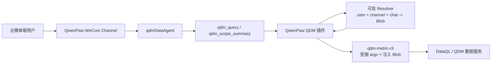

# QwenPaw QDM 插件 PoC：开发经验与正式化参考

> 状态：Windows + QwenPaw 本地 Blob PoC 已跑通；Linux、企微用户到 Blob 的 Resolver
> 和 Gateway/ACP 尚未在生产环境验证。
>
> 本文是 `harness-data` 后续实现 QwenPaw 适配的设计输入，不应将当前 runtime 目录直接
> 当作正式源码或直接发布到多用户环境。

## 1. PoC 范围与已验证结论

PoC 插件的开发源目前位于：

```text
D:\qdm-harness-data1\harness-data-runtime\agents\qwenpaw
```

已在 Windows QwenPaw + 企微会话中验证：

- QwenPaw 插件能注册 `qdm_query`、`qdm_scope_summary` 两个内部工具；
- 业务查询能通过固定的 `qdm-metric-cli analysis execute` 路径取数；
- 插件代为注入加密 Blob，模型不能传入或替换鉴权参数；
- `qdm_scope_summary` 能返回脱敏后的权限范围；
- QwenPaw 热安装可更新插件和 `qdmDataAgent` 工具配置；
- Windows 本地 Blob 模式下，CLI 网络环境、UTF-8 输出和工具返回都可正常工作。

当前 PoC **不等于**企微用户鉴权：`local_blob` 模式使每一个频道用户共享同一 Blob 的范围，
仅允许用于单用户验证。

## 2. 推荐的正式架构



正式实现的信任边界：

1. 模型只可以给出业务查询参数，不能提供用户 ID、Blob、Resolver 命令或任意 Shell 命令。
2. 插件从 QwenPaw 上下文获取可信的企微单聊请求者，并每次工具调用向 Resolver 获取 Blob。
3. 插件只允许两条受控 CLI 路径：`analysis execute` 与 `auth describe`。
4. Resolver 在服务端决定用户是否有权限，并返回与请求用户一致的加密 Blob。
5. QDM CLI 才是数据范围过滤的最终执行者；插件不解密 Blob、不自行拼接过滤条件。

## 3. PoC 中应保留的关键设计

### 3.1 不暴露通用 CLI 工具

`qdm_query(command_args)` 的实现固定拼接：

```text
qdm-metric-cli analysis execute <command_args> --data-auth --auth-blob <trusted blob>
```

因此 `command_args` 的语义只能是 `analysis execute` 之后的参数，例如：

```json
{
  "command_args": [
    "--start-date", "2026-08-19",
    "--end-date", "2026-08-19",
    "--metric", "saleAmt"
  ]
}
```

不得将该工具扩展成“运行 qdm CLI 任意命令”的包装器。必须拒绝模型探测的
`--help`、`version`、`health`、`auth`、`--auth-blob`、`--auth-json`、`--data-auth`
等参数；否则既会产生无意义错误，也会扩大权限绕过面。

### 3.2 Agent 必须使用工具白名单

仅禁用 Shell 不足以保护本地 Blob。若 `read_file`、`write_file`、网页、浏览器、桌面截图、
子代理或委托工具保持启用，模型仍可能绕过 `qdm_query` 读取本机文件，或以非 QDM 来源回答。

QDM 数据专用 Agent 当前仅启用：

```text
qdm_query
qdm_scope_summary
get_current_time
```

正式安装器必须以显式 allowlist 实现这一规则，而不是靠提示词约束。若未来需要文件导出或
报告生成，应新增受限的专用工具，不能重新开放通用文件/Shell 工具。

### 3.3 Prompt 是工具契约的第二道防线

QwenPaw 的 `register_prompt_section` 可在系统提示的 `env_context` 后注入插件规则。该规则
应说明：

- `qdm_query` 不是 Shell，也不是通用 CLI；
- 用户的相对日期按 `Asia/Shanghai` 计算；
- “昨天销售额”优先映射为 `saleAmt` 和同日起止日期；
- 不得通过 Browser、HTTP、数据库或本地可执行文件绕过 QDM 工具；
- 指标、日期口径不明确时应追问，不得用工具探测参数。

工具描述、插件 Prompt、`skills/qdm-harness/SKILL.md` 三处必须保持同一契约。仅修改工作区
`AGENTS.md` 不可靠，因为它是用户工作区内容，可能被覆盖或与插件版本漂移。

### 3.4 QwenPaw 注册实现细节

QwenPaw 2.1.x 在注册期间会在工具 callable 上附加描述信息。Python bound method 不能安全地
承载该属性，因此不要直接注册 `self.qdm_query`；应在 `register()` 中定义普通 async closure，
再委托给实例方法。

安装时 Agent 的 `agent.json` 工具配置可能覆盖插件声明的描述和配置。因此安装器应在每次安装
后明确写入 QDM 工具的 `description`、`config`、`enabled` 状态，不能只在配置缺失时写入。

## 4. Blob 与进程安全经验

### 4.1 Blob 处理原则

- Blob 仅从 operator 配置的本地文件或可信 Resolver 获取；绝不来自模型工具参数。
- 每次查询都重新解析/读取 Blob；不要把跨会话 Blob 缓存在 Agent 状态中。
- 对本地 Blob 只接受绝对、普通文件；Linux 额外要求权限不宽于 `0600`。
- 子进程执行前清理 `HARNESS_AUTH_BLOB`、`HARNESS_AUTH_BLOB_FILE`、
  `HARNESS_AUTH_USER_ID`、`LUMI_REQUESTER_CONTEXT_DIR` 等来源环境变量。
- 日志、工具异常、诊断信息、模型上下文中必须脱敏 `qdm1enc...` 内容。

### 4.2 不要过度收缩子进程环境

早期实现只将 `PATH` 和 `LANG` 传给 QDM CLI，Windows 上会丢失 `SystemRoot`、代理、证书及
DNS 所需环境，导致网络访问异常。正确做法是继承宿主环境，再只清理 Blob 来源变量。

### 4.3 Windows 编码与输出截断

Windows `subprocess.run(text=True)` 会按本地默认编码读取输出；QDM CLI 输出 UTF-8 JSON 时，
可能出现 GBK 解码异常。插件调用 CLI 和 Resolver 都应指定：

```python
text=True, encoding="utf-8", errors="replace"
```

错误脱敏与成功结果处理必须分离：

- 错误信息可限长（当前 1000 字符），并用退出码补充空输出场景；
- 成功 JSON 只能按工具输出上限截断（当前默认 64 KiB），不能套用错误信息的 1000 字符限制。

否则 `auth describe` 这种正常但较长的 JSON 会被截断，表现为 JSON 解析失败或空权限摘要。

### 4.4 权限摘要最小披露

`auth describe` 原始输出含 Blob 所属的 `userId`、`displayName`。在本地 Blob PoC 中，这些字段
不应被频道内其他用户看到。`qdm_scope_summary` 应只返回：

```json
{
  "enabled": true,
  "capabilities": ["..."],
  "dataScope": {"...": ["..."]},
  "labelsResolved": true
}
```

正式 Resolver 模式也应遵循最小披露：除非业务确有需求，不向模型或频道暴露身份字段和原始
授权文档。

## 5. 已遇到问题及处理方式

| 现象 | 根因 | 正式实现要求 |
| --- | --- | --- |
| 模型调用 `qdm_query(["--help"])`、`health`、`version` 失败 | 工具契约未讲清，模型误认为是通用 CLI | Prompt + 工具描述明确固定前缀；入口代码拒绝探测 token |
| `qdm_scope_summary` 报 `NoneType is not iterable` | CLI 非 0 且 stdout/stderr 为空，错误脱敏函数未处理 `None` | 脱敏函数接受 `object`；空错误显示退出码，不二次抛异常 |
| 权限摘要为空或 JSON 不完整 | Windows 默认 GBK 解码、成功输出误按错误上限截断 | 固定 UTF-8；分开“脱敏”和“错误限长” |
| Blob 可能被其他工具读取 | Agent 只禁用了 Shell，仍存在文件与网页工具 | 安装器强制工具 allowlist |
| 重新安装后配置未更新 | 旧安装器仅在工具 config 不完整时更新 | 每次安装都覆盖 QDM 工具 config |
| Windows 能运行、Linux 路径不可用 | CLI 名称与路径写死为 `.exe` 与 `D:` | 平台配置 + 参数化安装，核心 Python 不写死路径 |

## 6. 跨平台安装与配置约定

当前 PoC 已将安装器调整为：

```text
CLI 参数 > YAML/JSON 配置文件 > 平台安全默认值
```

支持参数：

```text
--config
--cli-path
--blob-file
--auth-mode
--resolver-command
--qwenpaw-working-dir
--agent-id
```

`--resolver-command` 必须是 JSON 参数数组，不能接受 shell 命令字符串，避免 shell 解析、注入和
跨平台 quoting 差异。

参考模板：

- Windows PoC：`agents/qwenpaw/config/qwenpaw-qdm.windows.yaml`
- Linux 生产：`agents/qwenpaw/config/qwenpaw-qdm.linux.yaml`

Linux 安装必须显式提供 `requester_resolver`；没有 Resolver 配置时，安装应失败而不是退回到
共享 `local_blob`。服务账号应拥有 QwenPaw 目录和 CLI/Resolver 的执行权限，Blob 文件权限
应为 `0600`。

## 7. harness-data 正式开发建议

### 7.1 源码归属与发布

当前 `D:\qdm-harness-data1\harness-data-runtime` 是安装产物验证源，后续应将可维护源码迁入
`harness-data`，建议目标结构：

```text
harness-data/
  agents/qwenpaw/
    backend.py
    qdm_auth.py
    plugin.json
    install-qwenpaw-plugin.py
    config/
    deploy/
    skills/qdm-harness/SKILL.md
    tests/
```

`npm` 安装器应像其他 Agent 适配一样复制/准备该插件源，并提供：安装、更新、卸载、预检和
诊断入口。不要把用户目录中的 QwenPaw 已安装副本纳入版本控制。

### 7.2 分阶段计划

1. **P0：源码迁移与可重复安装**：将已验证 PoC 迁入 `agents/qwenpaw`，补充 manifest、安装器
   集成、配置模板及单元测试。
2. **P1：Linux Resolver**：实现并独立部署“企微 userId + channel + chatId → Blob”的可信服务/
   命令；对用户不匹配、群聊、Resolver 超时和无权限全部 fail closed。
3. **P2：真实渠道回归**：用独立测试用户验证单聊取数、权限摘要、拒绝路径、日志脱敏和插件热
   更新；不得仅以 mock 结果代替。
4. **P3：发布与运维**：将 Linux 配置放入受控部署系统，Blob/Resolver 配置不进入 Git；增加健康
   诊断、版本兼容矩阵、回滚说明和审计关联 ID。
5. **P4：扩展能力**：在 QDM 插件边界稳定后，再评估 `qdm-metric-cli Gateway`、ACP 外部 Agent
   委托。它们必须复用同一权限解析与工具 allowlist，不得绕过插件鉴权。

### 7.3 建议的验收用例

- 单聊“查询昨天销售额”只产生一次受控 `qdm_query`，使用 `saleAmt` 与上海时区日期；
- `--help`、`version`、`health`、模型自带 auth 参数全部被拒绝；
- 本地 Blob/Resolver 不可通过任何 Agent 工具、日志或报错读取；
- `qdm_scope_summary` 返回范围但不返回 `userId`、`displayName`、Blob；
- Linux Resolver 对群聊、未知用户、身份不匹配、超时、空 Blob 统一拒绝，且不启动 QDM CLI；
- CLI 非 UTF-8/空错误/超长 JSON 时，插件给出稳定、脱敏、可定位的结果；
- Windows 与 Linux 均能以各自 YAML 配置完成预检和安装，且 Agent 仅启用三项 allowlist 工具。

## 8. 当前不应做的事

- 不要把 `local_blob` 描述为企微用户鉴权，也不要用于多用户生产机器人；
- 不要开放通用 Shell，或用 `qdm_query` 承载任意 CLI 命令；
- 不要把 Blob、企微密钥、Resolver 配置或真实绝对路径提交到仓库；
- 不要仅依赖 Prompt 控制权限边界；所有关键约束必须在工具和安装配置中强制执行；
- 未完成 Resolver 真实渠道回归前，不要接入 ACP/Gateway 并将其视为生产可用。

## 9. 参考实现与验证资产

PoC 的主要文件：

- `agents/qwenpaw/backend.py`：工具注册、Prompt、认证模式切换；
- `agents/qwenpaw/qdm_auth.py`：可信请求者、Blob Provider、argv 约束、CLI 执行与脱敏；
- `agents/qwenpaw/install-qwenpaw-plugin.py`：跨平台配置、安装、Agent 工具隔离；
- `agents/qwenpaw/tests/test_qdm_poc.py`：工具注册、Blob、Resolver、错误处理、输出处理、工具
  隔离与配置覆盖测试。

在迁移到正式仓库前，应先将以上测试改为相对源码路径，并新增 Linux CI（至少覆盖 YAML 配置、
文件权限、Resolver fake 与安装器 `--what-if`）。
